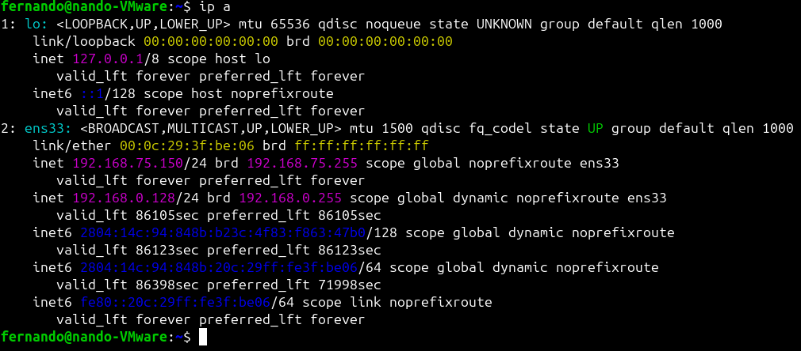
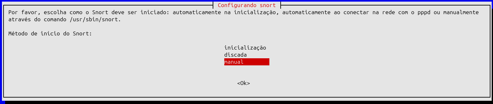
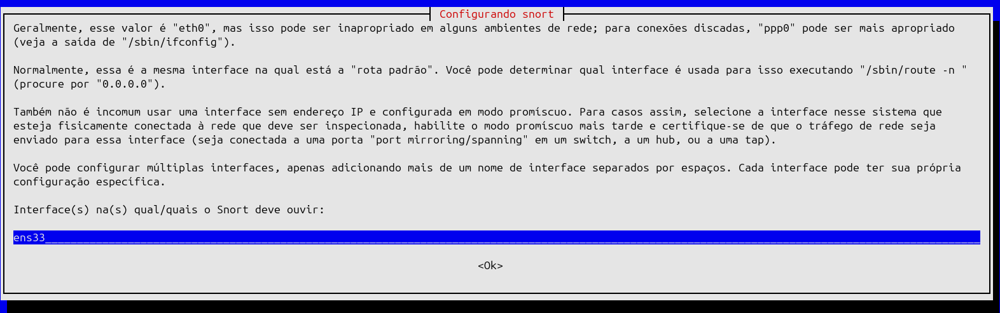
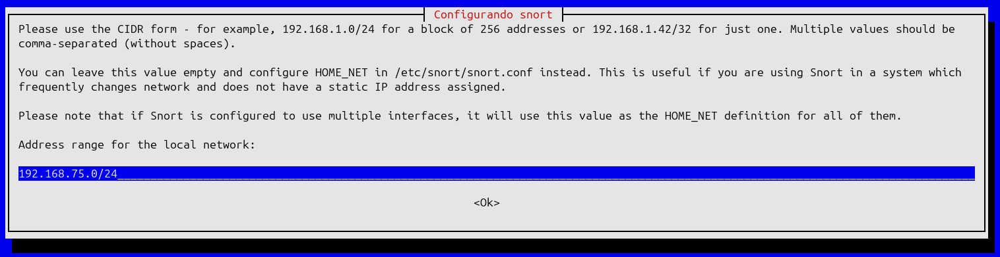
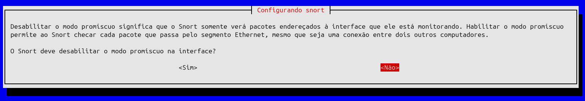
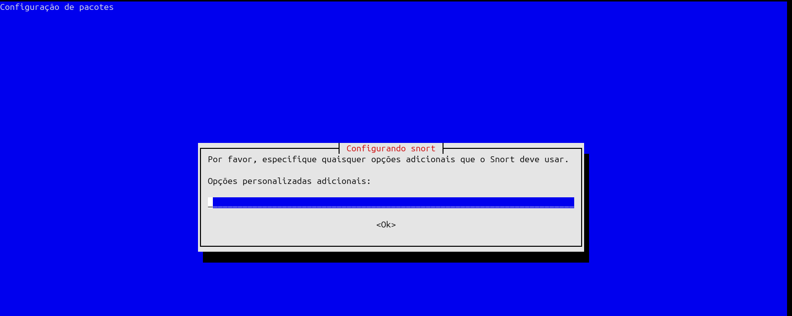
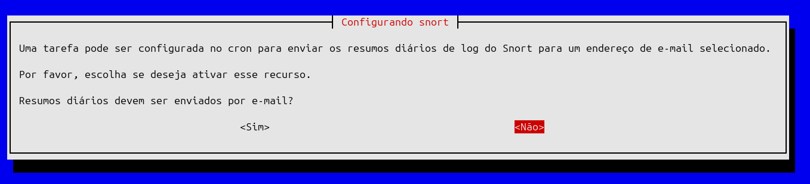
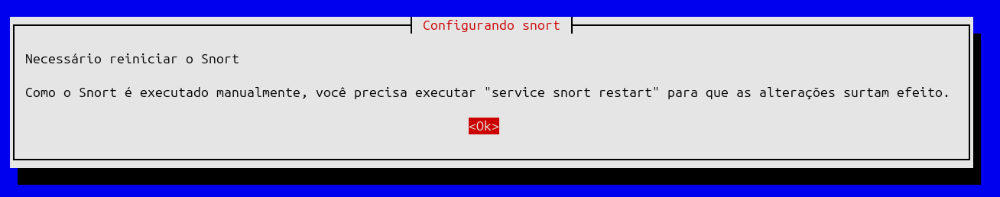

# Implementação e Tuning de Sistema de Detecção de Intrusões (IDS) com Snort

## 📋 Descrição

Laboratório prático focado na **configuração, criação de regras customizadas e refinamento (tuning)** de um IDS Snort em ambiente Linux para monitoramento de tráfego de rede e detecção de atividades de reconhecimento.

---

## 🎯 Problema Resolvido

Redes corporativas sofrem constantemente com **tentativas de varredura e reconhecimento** por parte de atacantes. O desafio é implementar um sensor capaz de detectar essas anomalias em **tempo real**, gerando alertas precisos para a equipe de Blue Team, minimizando os **falsos positivos (Fadiga de Alerta)**.

---

## 🏗️ Topologia / Arquitetura

```
┌─────────────────────────────────────────────────┐
│  Máquina Física (Windows)                       │
│  - Atacante Simulado                            │
│  - Disparos ICMP (ping)                         │
└────────────┬────────────────────────────────────┘
             │
             │ Modo Bridge
             │
┌────────────▼────────────────────────────────────┐
│  Máquina Virtual (Ubuntu 24.04 LTS)             │
│  - Defensor (Sensor IDS)                        │
│  - Snort em modo promíscuo                      │
│  - Interface monitorada: ens33                  │
└─────────────────────────────────────────────────┘
```

### Componentes:

- **Atacante Simulado**: Máquina Física hospedeira (Windows) executando disparos ICMP
- **Rede**: Adaptador em modo Bridge, simulando tráfego externo para a rede local da VM
- **Defensor (Sensor IDS)**: Máquina Virtual Ubuntu 24.04 LTS executando o Snort em modo promíscuo

---

## 🛠️ Ferramentas e Tecnologias Aplicadas

- Linux (Ubuntu 24.04 LTS)
- Snort IDS (Intrusion Detection System)
- Redes TCP/IP & Protocolo ICMP
- Virtualização (VMware/VirtualBox)
- GNU nano ou vi (editores de texto)

---

## 📸 Demonstração de Resultados

### 1️⃣ Descobrindo a Interface de Rede e o IP

Primeiro, identificamos os adaptadores de rede e o IP da máquina Ubuntu:

```bash
$ ip a
```



Neste laboratório utilizamos a interface **ens33** com IP **192.168.0.128** (ou similar, dependendo do ambiente).

---

### 2️⃣ Instalando o Snort

Instalamos o Snort via gerenciador de pacotes APT:

```bash
$ sudo apt install snort -y
```


**Resultado esperado**: Snort versão 2.9.15.1 ou superior instalado com sucesso.

---

### 3️⃣ Configurando o Snort

Durante a instalação, o Snort exibe um assistente de configuração interativo (ncurses) para:

1. **Método de Inicío**: Escolha entre inicialização automática ou manual
2. **Definição de HOME_NET**: Configure a rede local (ex: 192.168.0.0/24)
3. **Definição de EXTERNAL_NET**: Configure como redes externas (!$HOME_NET)
4. **Configuração de Interfaces**: Selecione as interfaces a monitorar (ex: ens33)
5. **Habilitação do Modo Promíscuo**: Essencial para capturar todo o tráfego









---

### 4️⃣ Reiniciando o Snort + Backup do local.rules

Após a configuração, reinicie o serviço e faça backup da arquivo de regras:

```bash
$ service snort restart
$ sudo cp /etc/snort/rules/local.rules /etc/snort/rules/local.rules.backup
```


---

### 5️⃣ Editando Regra do local.rules

Edite o arquivo de regras para adicionar uma regra customizada de detecção de ICMP:

```bash
$ sudo nano /etc/snort/rules/local.rules
```

**Regra Inicial** (com falsos positivos):
```
alert icmp any any -> $HOME_NET any (msg:"ALERTA DE SEGURANÇA: Ping (ICMP) detectado!"; sid:1000001; rev:1;)
```

**Anatomia da Regra**:

| Componente | Explicação |
|-----------|-----------|
| `alert` | **Ação**: O que o Snort deve fazer? Gerar um alerta nos logs |
| `icmp` | **Protocolo**: Procuramos por pacotes ICMP (ping) |
| `any any` | **Origem**: Qualquer IP (`any`) vindo de qualquer porta (`any`) |
| `->` | **Direção**: Tráfego da origem para o destino |
| `$HOME_NET any` | **Destino**: Nossa rede configurada (ex: 192.168.0.0/24) em qualquer porta |
| `msg:"..."` | **Mensagem**: Texto exibido no alerta para o analista de segurança |
| `sid:1000001` | **ID da Regra**: Identificação única (customizadas > 1.000.000) |
| `rev:1` | **Revisão**: Versão da regra |


---

### 6️⃣ Testando o Snort

Ativamos o Snort em modo console para visualizar alertas em tempo real:

```bash
$ sudo snort -A console -q -c /etc/snort/snort.conf -i ens33
```

**Problema Identificado**: O Snort começou a apresentar **falsos positivos**, gerando alertas mesmo antes de disparos reais de ping.


---

### 7️⃣ Refinando a Regra (Tuning)

Para eliminar os falsos positivos, refinamos a regra especificando:

**Regra Refinada**:
```
alert icmp $EXTERNAL_NET any -> $HOME_NET any (msg:"ALERTA DE SEGURANÇA: Ping (ICMP) Externo detectado!"; itype:8; sid:1000001; rev:2;)
```

**O que mudou**:

| Mudança | Benefício |
|---------|-----------|
| `$EXTERNAL_NET` | Apenas alertamos se tráfego vier **de fora** da nossa rede |
| `itype:8` | Filtramos especificamente o Tipo 8 do ICMP (Echo Request = ping) |
| `rev:2` | Incrementamos a revisão pois alteramos a regra |


---

### 8️⃣ Simulando o Reconhecimento (O "Ataque")

#### ✅ Ativando Snort

```bash
$ sudo snort -A console -q -c /etc/snort/snort.conf -i ens33
```


#### 🎯 Disparando Ping da Máquina Física

Na máquina hospedeira (Windows), dispare ping contra o IP do Ubuntu:

```cmd
C:\Users\Fernando> ping 192.168.0.128
```


#### 🚨 Detecção Bem-Sucedida

O terminal do Ubuntu (Snort) recebe **exatamente o alerta programado**, limpo e **sem falsos positivos**:


**Resultado**: Alertas precisos, sem fadiga de alarme!

---

## 📚 Aprendizados Adquiridos

### Conceitos Técnicos Aplicados:

1. **Modo Promíscuo em Interfaces de Rede**
   - Permite capturar todo o tráfego passando pela interface
   - Essencial para operação de IDS/IPS

2. **Instalação e Configuração de Sensores IDS em Linux**
   - Configuração de variáveis de ambiente (HOME_NET, EXTERNAL_NET)
   - Seleção de interfaces de rede para monitoramento

3. **Anatomia e Escrita de Regras de Detecção Customizadas**
   - Componentes: Ação, Protocolo, Origem, Destino, Flags
   - SIDs (Snort IDs) para identificação de regras
   - Revisões para rastreamento de mudanças

4. **Técnicas de Tuning para Mitigação de Falsos Positivos**
   - Uso de variáveis de ambiente ($EXTERNAL_NET, $HOME_NET)
   - Especificadores de tipo de pacote (itype:8 para ICMP Echo Request)
   - Direcionamento preciso de origem/destino
   - Filtragem de ruído interno (tráfego da própria rede)

### Insights de Segurança:

- **Detecção Ativa**: Um IDS bem configurado pode detectar tentativas de reconhecimento em tempo real
- **Fadiga de Alerta**: Falsos positivos em excesso prejudicam a resposta a incidentes reais
- **Tuning é Essencial**: Regras genéricas precisam ser refinadas para o contexto específico
- **Logging Centralizado**: Essencial manter histórico de alertas para análise forense

---

## 🔧 Comandos Úteis

```bash
# Reiniciar o serviço Snort
$ service snort restart

# Verificar status do Snort
$ service snort status

# Editar regras customizadas
$ sudo nano /etc/snort/rules/local.rules

# Executar Snort em modo console (tempo real)
$ sudo snort -A console -q -c /etc/snort/snort.conf -i ens33

# Executar Snort em modo silent (logs)
$ sudo snort -l /var/log/snort -c /etc/snort/snort.conf -i ens33

# Validar arquivo de configuração
$ sudo snort -c /etc/snort/snort.conf -T
```

---

## 📝 Notas Importantes

- **SID (Snort ID)**: Regras customizadas DEVEM ter SID > 1.000.000
- **Revisões**: Sempre incremente `rev` ao editar uma regra
- **Modo Promíscuo**: Requer privilégios de root/sudo
- **Interface Correta**: Use `ip a` ou `ifconfig` para identificar a interface de rede
- **Arquivo de Regras**: Sempre faça backup antes de editar
- **Variáveis de Rede**: Garanta que HOME_NET e EXTERNAL_NET estejam corretos

---

## 🎓 Conclusão

Este laboratório demonstra a importância da **defesa em profundidade** através de detecção de intrusões. Um IDS bem configurado e refinado é uma ferramenta essencial para qualquer SOC (Security Operations Center) ou equipe de Blue Team responsável por monitoramento e resposta a incidentes de segurança.

**Próximos Passos**: Explore regras mais complexas, integre com SIEM e implemente automação de resposta a alertas!

---

**Laboratório realizado em**: Maio de 2026  
**Sistema**: Ubuntu 24.04 LTS com Snort 2.9.15.1+  
**Propósito**: Educacional - Treinamento em Detecção de Intrusões
