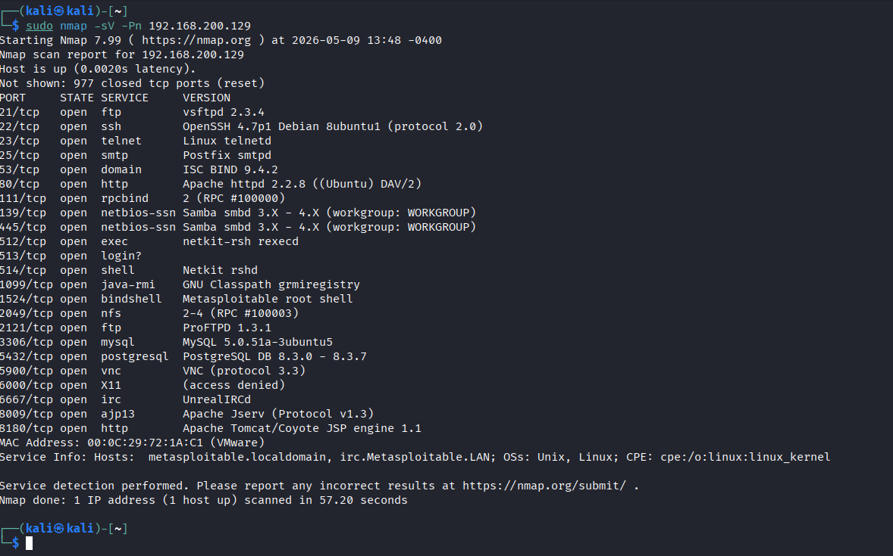
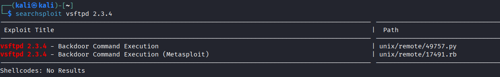
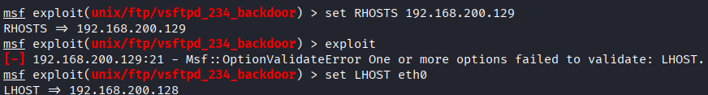
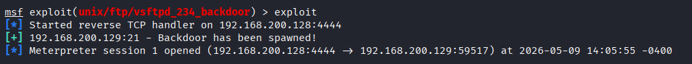
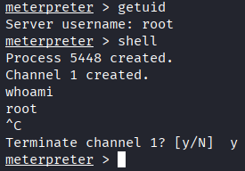

# Laboratório de Penetration Testing: Configuração de Sandbox e Exploração de Backdoor (CVE-2011-2523)

## 1. Problema Resolvido (O Contexto)
O objetivo deste projeto foi construir um laboratório virtualizado seguro (Sandbox) para a prática de testes de intrusão, garantindo isolamento total da rede física. Em seguida, o ambiente foi utilizado para mapear ativamente a superfície de ataque de um servidor vulnerável, culminando na exploração bem-sucedida de um backdoor em um serviço de transferência de arquivos (FTP), demonstrando os riscos de manter sistemas legados ou softwares não homologados em infraestruturas corporativas.

## 2. Topologia e Arquitetura
* **Hypervisor:** VMware (configurado com switch virtual dedicado).
* **Rede:** Arquitetura Host-only (isolamento total de Layer 2 e Layer 3, sem acesso à internet ou ao roteador local).
* **Máquina Atacante:** Kali Linux (IP: `192.168.200.128`).
* **Máquina Alvo:** Metasploitable 2 (IP Fixo interno: `192.168.200.129`).

## 3. Ferramentas e Tecnologias Aplicadas
* **VMware Network Configuration:** Para criação da rede Host-only.
* **Nmap:** Para varredura de portas, banner grabbing (identificação de versões) e evasão básica de restrições utilizando a flag `-Pn` (desabilitando a verificação de host via ping).
* **Searchsploit (Exploit-DB):** Para mapeamento de vulnerabilidades locais e busca de módulos correspondentes ao serviço identificado.
* **Metasploit Framework (MSF):** Para configuração do módulo de exploração, definição de variáveis (RHOSTS e LHOST apontando para a interface `eth0`) e execução do ataque.
* **Meterpreter:** Para ações de pós-exploração avançada no sistema comprometido.

## 4. Demonstração de Resultados

**1. Mapeamento de Rede e Identificação de Serviço:**
Varredura com Nmap (`-sV -Pn`) identificando múltiplas portas abertas, com destaque para o serviço `vsftpd 2.3.4` rodando na porta 21 do alvo (`192.168.200.129`).

**2. Busca por Vulnerabilidades (Vulnerability Mapping):**
Utilização do `searchsploit` confirmando a existência de um exploit do tipo *Backdoor Command Execution* para a versão exata do serviço (vsftpd 2.3.4), incluindo um módulo nativo em Ruby no Metasploit.

**3. Preparação do Exploit:**
Configuração do módulo `unix/ftp/vsftpd_234_backdoor` no Metasploit. Definição do alvo (RHOSTS) e correção do parâmetro de escuta (LHOST) apontando corretamente para a interface `eth0` do atacante (`192.168.200.128`).

**4. Execução e Acesso Inicial:**
Disparo do exploit. O backdoor é ativado com sucesso no serviço alvo, estabelecendo uma conexão reversa via TCP e abrindo uma sessão interativa Meterpreter.

**5. Pós-Exploração e Escalação de Privilégios:**
Validação do comprometimento total do sistema. A execução do comando `getuid` no Meterpreter, e posteriormente `whoami` no shell interativo, confirmam o nível máximo de privilégio alcançado no servidor (`root`).

## 5. Aprendizados Adquiridos (Diferencial Analítico)
* **Segurança de Infraestrutura:** A importância vital de isolar ambientes de teste para evitar vazamento de malwares ou tráfego anômalo para a rede de produção.
* **Troubleshooting em Varreduras:** Como lidar com bloqueios ou respostas silenciosas durante varreduras de rede. Ao forçar o Nmap a atuar ignorando o ping tradicional (`-Pn`), demonstra-se que a compreensão profunda dos protocolos de rede é fundamental para o sucesso do reconhecimento (Recon).
* **Mecânica Prática de Exploits:** Compreensão operacional do fluxo de um ataque, desde a escolha do payload correto até o preenchimento exato dos parâmetros de roteamento (RHOSTS e LHOST) para garantir que a conexão reversa alcance a máquina atacante, finalizando com a transição de um ambiente Meterpreter para o shell nativo do alvo.
