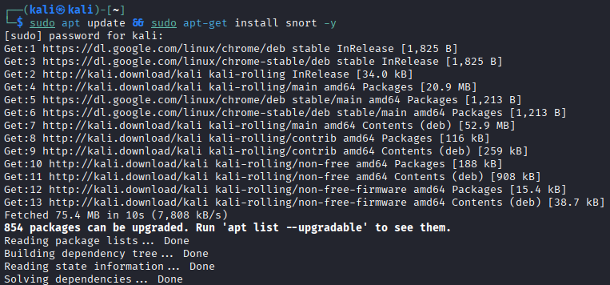
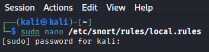
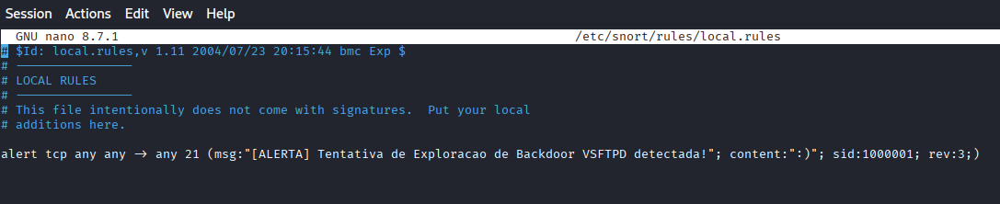
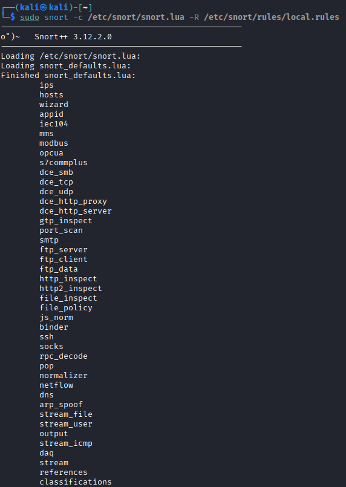
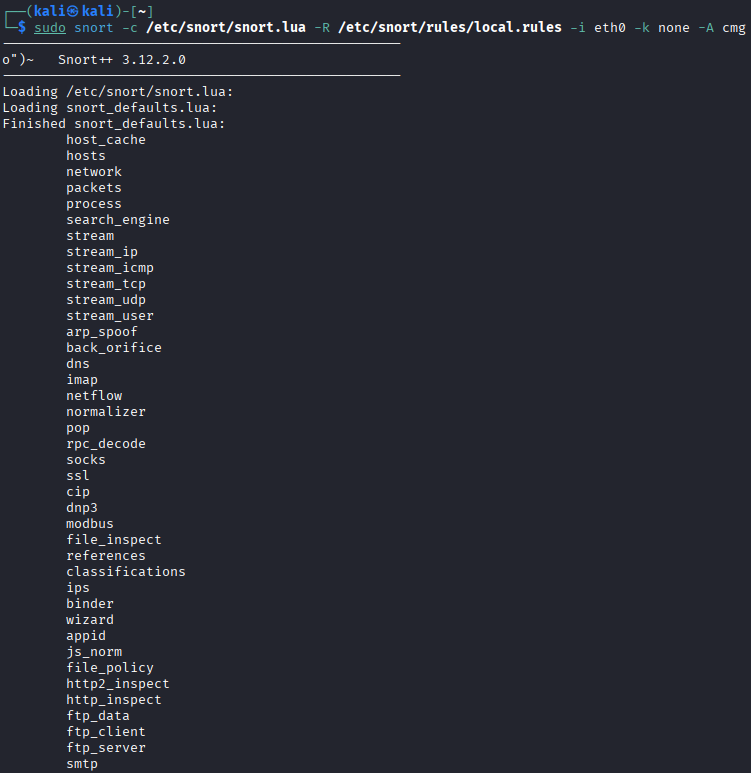
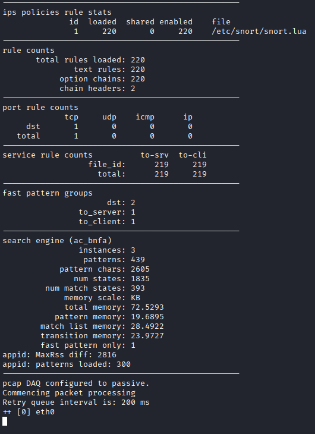
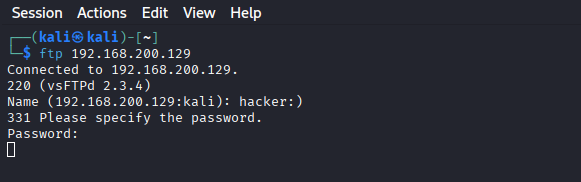
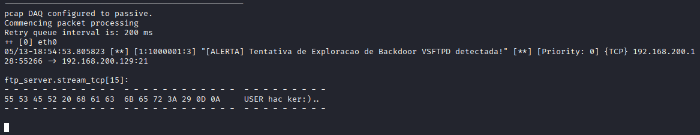

# Implementação de IPS e Virtual Patching com Snort 3 em Sandbox Isolada

## 1. Problema Resolvido

Sistemas legados frequentemente possuem vulnerabilidades conhecidas (CVEs) e nem sempre podem ser atualizados ou desligados imediatamente em ambientes de produção. O objetivo deste projeto foi atuar preventivamente, implementando um Sistema de Prevenção de Intrusão (IPS) para detectar e alertar tentativas de exploração (Virtual Patching) de um backdoor conhecido antes que o servidor fosse comprometido, operando dentro de uma infraestrutura de laboratório estritamente isolada.

## 2. Topologia e Arquitetura

- Rede: Sandbox isolada na camada de hypervisor (Host-only).
- Atacante: Kali Linux.
- Alvo: Metasploitable 2 (vsftpd 2.3.4).
- Ferramenta de Defesa: Snort++ 3.12 (IDS/IPS).

## 3. Gerenciamento de Dependências em Ambientes Isolados (Instalação)

Para garantir a integridade do laboratório (que não possui rota para a internet), a instalação do motor de detecção exigiu um bypass temporário e controlado de rede:

1. Alteração temporária da interface de rede da máquina virtual defensora (Kali Linux) de Host-Only para NAT.
2. Renovação de concessão de IP via DHCP:

```bash
sudo dhclient -v eth0
```

3. Instalação dos pacotes via repositório oficial:

```bash
sudo apt update && sudo apt install snort -y
```

4. Retorno imediato da interface de rede para o modo Host-Only e nova renovação de IP, reestabelecendo o isolamento (Air-Gap) antes da configuração das regras.

## 4. Ferramentas e Tecnologias Aplicadas

- Snort 3 / LUA: Configuração do motor de detecção moderna.
- Criação de Assinaturas (Custom Rules): Desenvolvimento de regras manuais (`local.rules`) com variáveis agnósticas (`any -> any`) para identificação de Indicators of Compromise (IOCs) específicos.
- Análise de Payload: Inspeção profunda de pacotes na camada de aplicação (Layer 7).
- Troubleshooting de Redes Virtuais: Contorno de Checksum Offloading (`-k none`) no hypervisor para evitar falsos negativos na análise de tráfego.

## 5. Demonstração de Resultados

A prova de conceito foi validada com a detecção em tempo real de uma tentativa de exploração do backdoor do VSFTPD 2.3.4. A seguir está a ordem cronológica das evidências capturadas durante o laboratório:

1. Instalação e preparação do Snort 3 na sandbox isolada.
2. Inicialização do Snort com a configuração Lua e rules customizadas.
3. Teste de envio do payload malicioso ao serviço VSFTPD.
4. Alerta gerado em tempo real com extração do payload.

### Capturas de tela (ordem cronológica)

1. 
   - Mostra a execução de `sudo apt update && sudo apt install snort -y` após o switch temporário para NAT.
2. 
   - Exibe o comando `sudo nano /etc/snort/rules/local.rules` antes de inserir a regra personalizada.
3. 
   - Regra criada para detectar o payload do backdoor VSFTPD 2.3.4.
4. 
   - Comando de execução do Snort em modo de teste com `-k none` e leitura da configuração Lua.
5. 
   - Confirmação de que as políticas, regras e o pcap DAQ estão ativos para captura de tráfego.
6. 
   - Conexão ao VSFTPD 2.3.4 com usuário `hacker` para gerar o tráfego malicioso.
7. 
   - Snort inicia o processamento de pacotes e fica pronto para detectar o ataque.
8. 
   - Alerta em tempo real e extração do payload: `USER hacker:))`.

A evidência final inclui o alerta:

**[ALERTA] Tentativa de Exploracao de Backdoor VSFTPD detectada!**

## 6. Aprendizados Adquiridos

- Compreensão prática da migração arquitetural de ferramentas de segurança (do Snort 2 monolítico para o Snort 3 baseado em Lua).
- Desenvolvimento de regras de detecção para garantir o disparo de alertas independentemente de configurações incorretas de zonas de rede.
- Capacidade de adaptar o monitoramento e a instalação de pacotes para lidar com particularidades de virtualizadores estritamente isolados.
