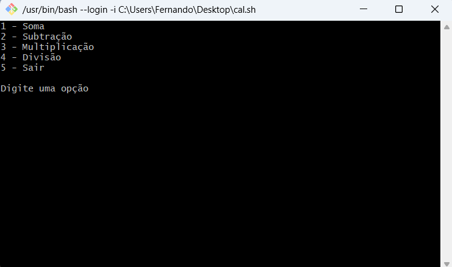

# Calculadora em Bash Script

Este é um projeto simples de uma calculadora implementada em Bash Script. O programa oferece operações básicas de matemática como soma, subtração, multiplicação e divisão, executadas em um loop contínuo até que o usuário escolha sair.

## Funcionalidades

- **Soma**: Adiciona dois números.
- **Subtração**: Subtrai o segundo número do primeiro.
- **Multiplicação**: Multiplica dois números.
- **Divisão**: Divide o primeiro número pelo segundo (com verificação para divisão por zero).
- **Sair**: Encerra o programa.

## Como Usar

1. Certifique-se de que você tem o Bash instalado no seu sistema.
2. Dê permissões de execução ao script: `chmod +x calculadora.sh`
3. Execute o script: `./calculadora.sh`
4. Siga as instruções no terminal para escolher a operação e inserir os números.

## Exemplo de Uso

## Tecnologias Utilizadas

- Bash Script

## Autor

Fernando Galvão - Projeto desenvolvido como parte do laboratório de cibersegurança.