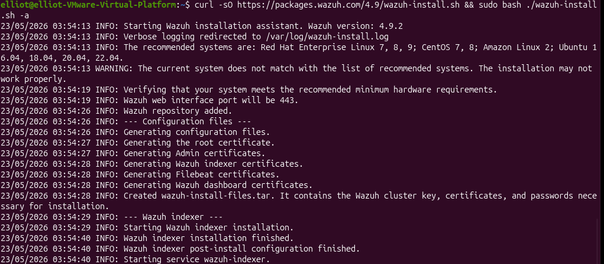
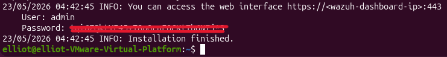
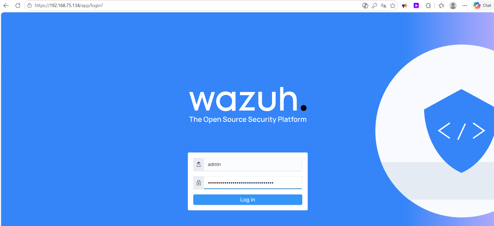
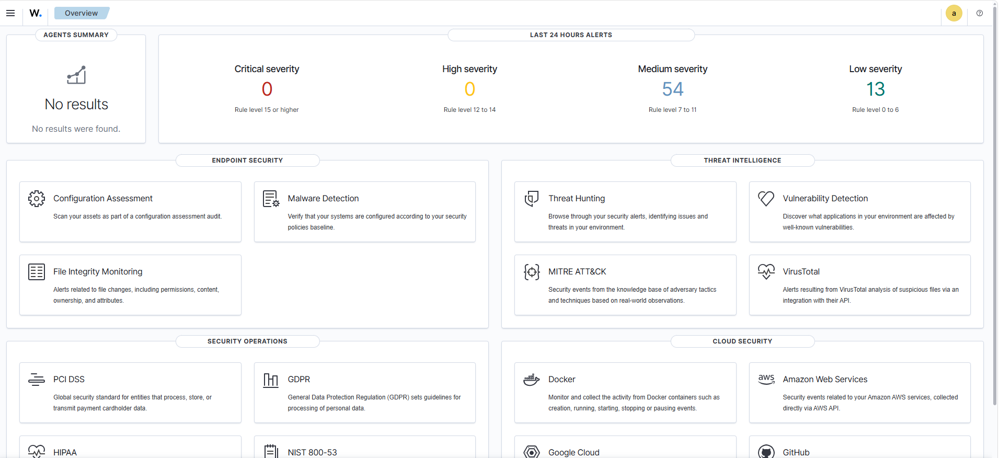
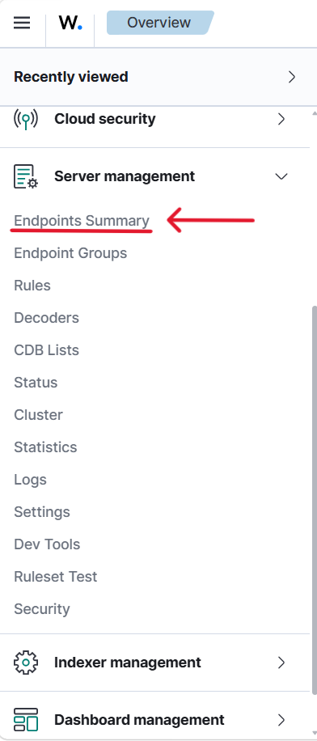
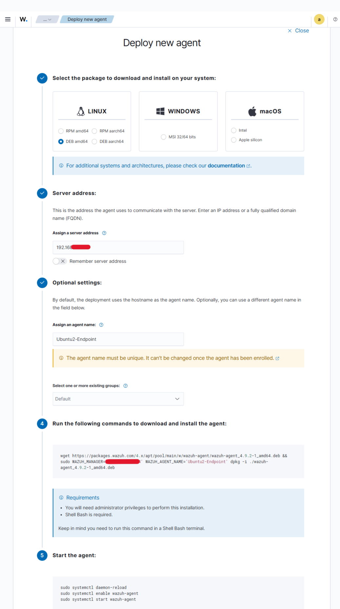
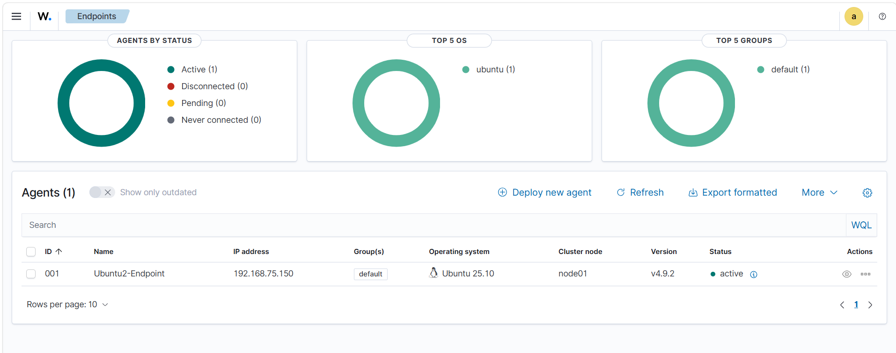
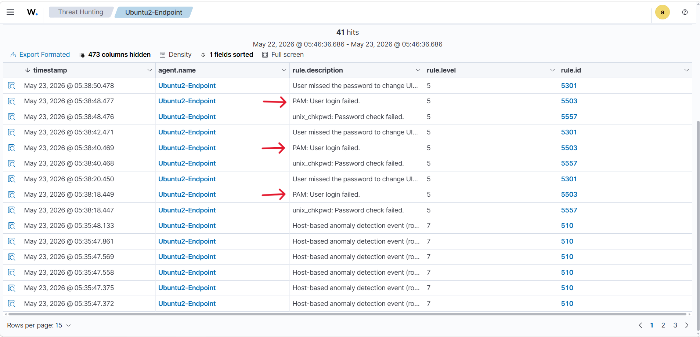

# Lab 05 - Implementação de um SOC com Wazuh SIEM XDR

## 📋 Descrição
Este laboratório documenta a implementação de um **SOC (Security Operations Center)** utilizando o **Wazuh SIEM/XDR** para coleta de eventos, correlação de alertas e monitoramento de endpoints Linux.

---

## 🎯 Problema Resolvido
Organizações precisam de um sistema centralizado para detectar e responder a incidentes em tempo real. O laboratório demonstra como estruturar um SOC básico com ingestão de dados de agentes e visualização de alertas no painel do Wazuh, reduzindo o tempo de detecção e melhorando a visibilidade de segurança.

---

## 🏗️ Topologia / Arquitetura
```
[ Rede / Host físico ]
           |
           v
[ Wazuh Manager + Indexer + Dashboard ]
           |
           v
[ Agente Ubuntu registrado ]
```

### Componentes
- `Wazuh Manager` (servidor principal) em `Ubuntu`
- `Wazuh Dashboard` (interface web)
- `Wazuh Agent` em `Ubuntu 2`
- Rede segura entre servidor e agente
- Certificados e HTTPS para comunicação confiável

---

## 🛠️ Ferramentas e Tecnologias Aplicadas
- `Wazuh SIEM/XDR`
- `Ubuntu` (agent)
- `HTTPS` / porta `134`
- `curl`, `bash`, `dpkg`
- `Wazuh Dashboard`
- `Linux` e `Web UI`

---

## 📸 Demonstração de Resultados
### 1️⃣ Instalando o Wazuh
A implantação do Wazuh foi iniciada com o script oficial de instalação.

```bash
curl -so wazuh-install.sh https://packages.wazuh.com/4.9/wazuh-install.sh
sudo bash ./wazuh-install.sh -a
```




Resultado: O instalador configurou todos os componentes e gerou as credenciais de acesso 
iniciais.

### 2️⃣ Acesso e login no Dashboard
Após a instalação, o acesso ao painel Wazuh é feito via navegador em `https://<wazuh-dashboard-ip>:134`.

Use as credenciais padrão do administrador ou a senha gerada durante a instalação.




### 3️⃣ Visão geral do painel Wazuh
O dashboard apresenta a tela inicial com o estado geral dos agentes, alertas recentes e métricas de segurança.



### 4️⃣ Cadastro e verificação de endpoints
Na seção de gerenciamento de servidor é possível visualizar os endpoints registrados e seu status de conexão.



### 5️⃣ Deploy do agente e instruções de instalação
A partir do painel, foi gerado o comando de instalação do agente para a máquina `Ubuntu 2`.



Resultado: O sistema gerou um bloco de comando de instalação personalizado para a instalação do agente.

No terminal da máquina `Ubuntu 2` (Alvo), colamos o comando gerado e ativamos o serviço para garantir a 
inicialização automática junto com o sistema operacional. 

### 6️⃣ Agente ativo e disponibilidade
Após a instalação e registro, o agente aparece como ativo no Wazuh Dashboard, confirmando a conexão com o servidor.



### 7️⃣ Teste de Validação e Detecção de Ameaças
Para validar a eficácia do SIEM, simulamos 
uma tentativa de troca de usuário para root, com senhas erradas, diretamente no terminal da máquina alvo.

Comando executado (Simulação de ataque):
```bash
$ su - root
```

### 8️⃣ Detecção de eventos e análise
Com o agente coletando dados, o Threat Hunting e o monitoramento de eventos capturaram a anomalia nos logs do sistema (PAM) e os enviou ao 
Manager.



---

## 🔍 Anatomia da Configuração / Código Principal
| Componente | Explicação |
|-----------|-----------|
| `curl -so wazuh-install.sh ...` | Baixa o instalador oficial do Wazuh. |
| `sudo bash ./wazuh-install.sh` | Executa a instalação com privilégios de administrador. |
| `https://<wazuh-dashboard-ip>:134` | Endereço padrão do painel Wazuh em HTTPS. |
| `admin` | Usuário típico para login inicial no Wazuh. |
| Registro do agente | Conecta a máquina Ubuntu ao manager Wazuh. |

---

## 📚 Aprendizados Adquiridos
### Conceitos Técnicos Aplicados
- Configuração de SOC com Wazuh.
- Registro e monitoramento de agentes Linux.
- Uso de painel web para análise de segurança.
- Comunicação segura entre agente e manager.

### Insights de Segurança/Negócio
- Importância de centralizar logs e alertas.
- Melhoria de visibilidade para equipes de resposta a incidentes.
- Benefício de agentes ativos para detecção de ameaças internas e externas.

---

## 🔧 Comandos Úteis
```bash
curl -so wazuh-install.sh https://packages.wazuh.com/4.9/wazuh-install.sh
sudo bash ./wazuh-install.sh -a
sudo systemctl enable wazuh-agent
sudo systemctl status wazuh-agent
sudo systemctl restart wazuh-agent
```

---

## 📝 Notas Importantes
- Execute a instalação com privilégios `root` ou `sudo`.
- Verifique se a porta `134` está liberada para o dashboard Wazuh.
- Garanta que o agente e o manager estejam na mesma rede lógica.
- Faça backup de configurações antes de mudanças críticas.

---

## 🎓 Conclusão
Este laboratório mostra a base de um SOC com Wazuh, cobrindo a instalação do servidor, login no dashboard, registro de agente e análise inicial de eventos. Como próximos passos, recomenda-se estender as regras de detecção, integrar fontes adicionais de log e automatizar respostas a incidentes.

---

## Autor

Fernando Galvão - Projeto desenvolvido como parte do laboratório de cibersegurança.

**Laboratório realizado em**: Maio 2026

**Propósito**: Educacional / Portfólio
