# Auditoria e Pentest em Aplicações Web (OWASP Top 10) utilizando DVWA e Docker

## Descrição

Laboratório prático focado na implantação, auditoria de segurança e exploração ética de vulnerabilidades em aplicações web utilizando o ecossistema DVWA (Damn Vulnerable Web Application). O projeto visa entender a mecânica por trás de falhas críticas de segurança de aplicações (AppSec) contidas no OWASP Top 10, capacitando o profissional a identificar brechas lógicas, conduzir pós-exploração de sistemas e sugerir mitigações.

## Problema Resolvido

Aplicações web corporativas são expostas publicamente e sofrem varreduras automáticas constantemente. Se os desenvolvedores não validarem as entradas de dados ou não impuserem limites de tentativas de acesso, atacantes podem roubar bancos de dados inteiros ou tomar o controle do servidor. Este laboratório resolve a lacuna teórica ao demonstrar de forma prática como falhas de configuração e lógica de código impactam a segurança do back-end. A utilização de containers Docker mitiga os riscos de comprometer o sistema operacional host, fornecendo um ambiente de testes volátil, controlado e altamente realista.

## Topologia / Arquitetura

```
[ Ubuntu 2 (host) ]
           |
[ Docker Engine ]
           |
[ Container DVWA (porta 80 interna) ]
           |
[ Navegador / auditoria local ou remota ]
```

### Componentes

- `Ubuntu 24.04 LTS`: máquina host e ambiente de auditoria.
- `Docker Engine`: isolamento de microsserviços e portabilidade do laboratório.
- `vulnerables/web-dvwa`: imagem Docker do DVWA.
- `Apache`, `PHP` e `MySQL`: stack do DVWA.
- Ferramentas de auditoria: `hydra` e `sqlmap`.

## Ferramentas e Tecnologias Aplicadas

- Docker para criação de ambiente isolado.
- DVWA para simulação de aplicação web vulnerável.
- Hydra para ataques de força bruta.
- SQLMap para avaliação de injeção de SQL.
- Apache, PHP e MySQL para suporte à aplicação.
- Rede local e port binding para acesso externo.

## Execução Prática e Demonstração de Resultados

### Fase 1: Preparação do Ambiente e Solução de Conflitos

Para evitar a necessidade de configurar manualmente Apache e MySQL, o Docker foi utilizado para subir a aplicação de forma isolada em um container. No terminal da máquina Ubuntu 2, atualizamos os repositórios locais e instalamos o serviço Docker.

```bash
sudo apt update
sudo apt install docker.io -y
sudo systemctl enable docker
sudo systemctl start docker
```

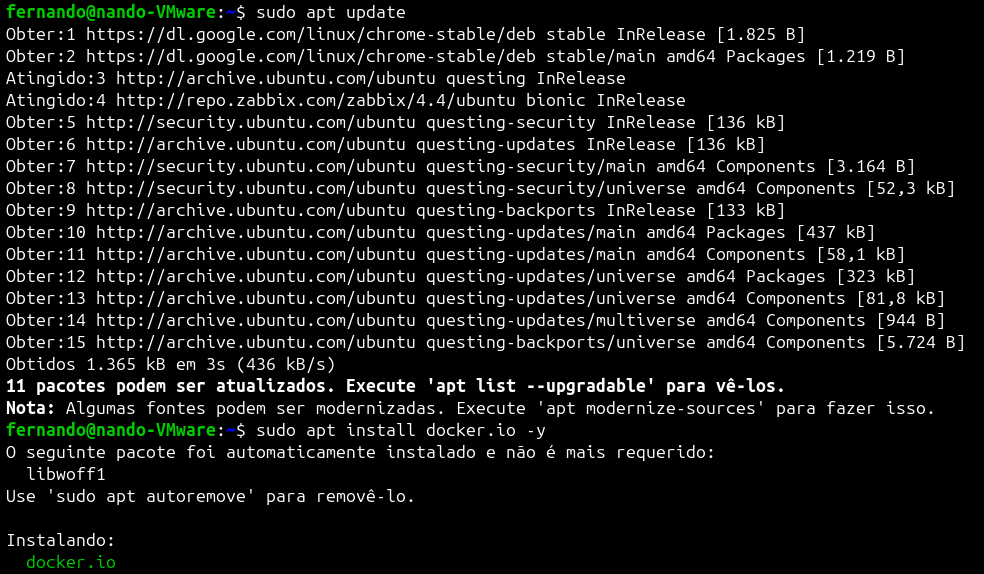

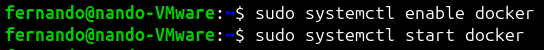

### Diagnóstico e Resolução de Conflito de Portas

Ao tentar iniciar o container mapeando a porta 80 do host para a porta 80 do container, o Docker retornou um erro de bind porque a porta já estava ocupada.

```bash
sudo docker run --rm -it -p 80:80 vulnerables/web-dvwa
```

O erro retornado foi:

`Bind for 0.0.0.0:80 failed: port is already allocated.`

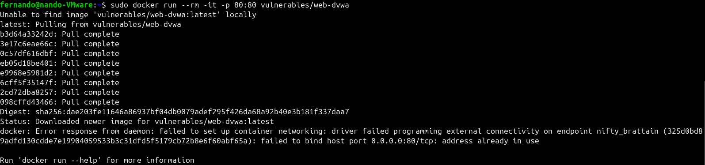

Foi então adotada a abordagem de usar a porta externa 8081 no host, apontando-a para a porta 80 interna do container.

```bash
sudo docker run --rm -it -p 8081:80 vulnerables/web-dvwa
```

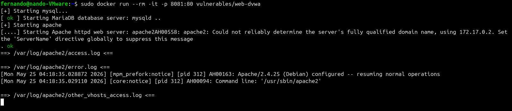

A aplicação tornou-se acessível pelo navegador da máquina física através da URL `http://192.168.75.150:8081`.

### Fase 2: Configuração Inicial da Aplicação Web

Ao acessar `http://192.168.75.150:8081`, a aplicação carregou a tela de verificação do ambiente e exigiu a inicialização do banco de dados relacional.

- O container já inclui o banco de dados MySQL.
- As tabelas do sistema fictício precisam ser criadas antes do uso.
- Clicou-se em `Create / Reset Database` para gerar a estrutura do banco.

As credenciais padrão utilizadas foram:

- Username: `admin`
- Password: `password`
- Nível de segurança: O sistema foi mantido no nível `Low`. Neste nível, o código-fonte da aplicação não possui nenhuma barreira de segurança ou filtro de proteção, permitindo o estudo do comportamento bruto da vulnerabilidade. 

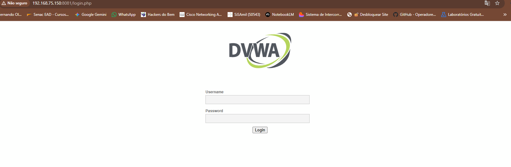

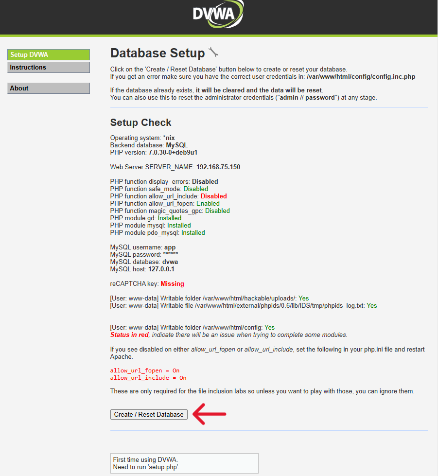

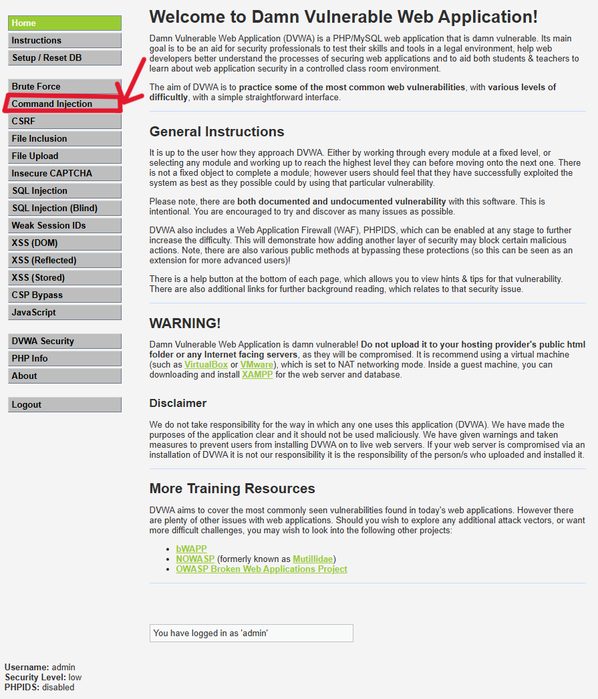

### Fase 3: Ataque de Força Bruta Automatizado (A07:2021 - Identification and Authentication Failures)

O ataque de Brute Force (Força Bruta) contra painéis de login ocorre quando um agente
automatizado tenta adivinhar combinações de usuário e senha repetidamente. A falha da
aplicação reside na ausência de Rate Limiting (Mecanismo de bloqueio após X tentativas
falhas) e na falta de Captchas.

### Preparação do Ataque com Dicionário Real

Foi instalado e utilizado a ferramenta Hydra, um quebrador de logins paralelizado
extremamente veloz, apontando para a wordlist histórica `rockyou.txt` (localizada em
/home/fernando/rockyou.txt), que contém milhões de senhas reais vazadas na internet.

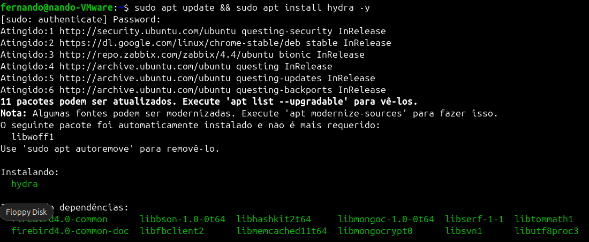

#### Comando Executado

Para atacar formulários web, o Hydra exige um formato rigoroso denominado http-getform. Após ajustes de depuração de comandos no terminal, o comando definitivo foi estruturado:


```bash
hydra -l admin -P /home/fernando/rockyou.txt 127.0.0.1 -s 8081   http-get-form "/vulnerabilities/brute/:username=admin&password=^PASS^&Login=Login:Username and/or password incorrect" -t 1
```

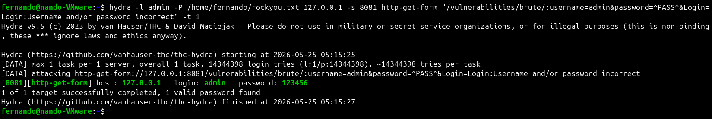


#### Anatomia do Comando

- `hydra`: executa a ferramenta de força bruta.
- `-l admin`: define o usuário alvo.
- `-P /home/fernando/rockyou.txt`: wordlist de senhas.
- `127.0.0.1 -s 8081`: endereço local e porta do DVWA.
- `http-get-form`: especifica o tipo de formulário HTTP.
- `/vulnerabilities/brute/...`: rota de login e campos do formulário.
- `-t 1`: reduz a velocidade para 1 tentativa por vez.

#### Resultado e Aprendizado

1. Ao rodar o ataque contra o usuário admin e também para um usuário inventado (-l
fernando), o Hydra me deu a senha 123456 quase na hora, além de outras. Percebi
na hora que isso era estranho e que eram falsos-positivos.

2. O que deu errado: O problema não foi uma falha no site (DVWA), mas sim um
detalhe no meu comando do Hydra. A frase de erro que eu mandei a ferramenta
procurar (Login: Username and/or password incorrect) provavelmente
não estava exatamente igual ao que a página do site responde (pode ter uma diferença
de espaço, formatação oculta do HTML ou pontuação).

3. Como o Hydra não conseguiu achar aquela frase exata na tela de resposta, ele se
confundiu e achou que todas as tentativas do dicionário estavam dando certo.

4. Aprendizado: Isso me mostrou que não basta só rodar a ferramenta. Na prática, eu
preciso inspecionar a página com muita atenção para copiar a mensagem de erro exata
(ou analisar como a página se comporta) antes de fa

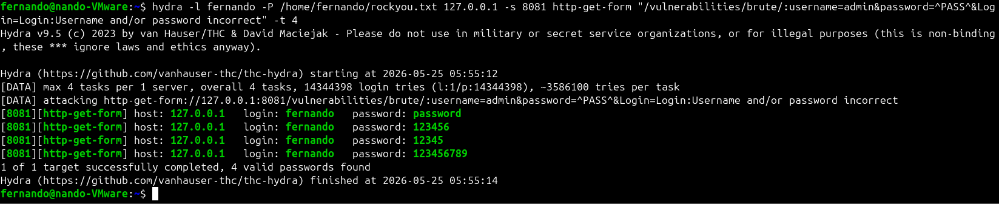

### Fase 4: SQL Injection Automatizado (A03:2021 - Injection)

O SQL Injection ocorre quando dados de entrada são concatenados diretamente em uma consulta SQL sem sanitização. No DVWA, o parâmetro `id` na URL foi explorado para extrair informações do banco MySQL.

Sendo assim, foi realizado a instalação do SQLMap:

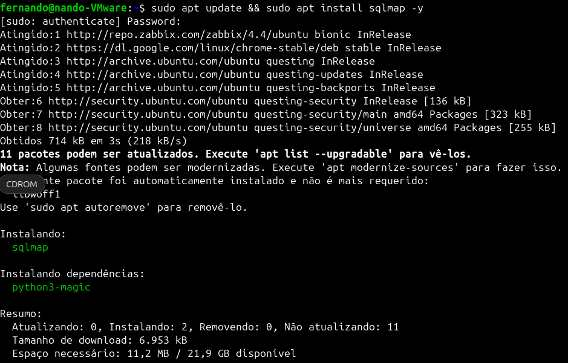


#### Mecanismo de Sessão

Para permitir que o SQLMap opere como um usuário autenticado, foi copiado o cookie de sessão do navegador:

`PHPSESSID=0i9vil01ilj05tgir1j5v7qb61; security=low`

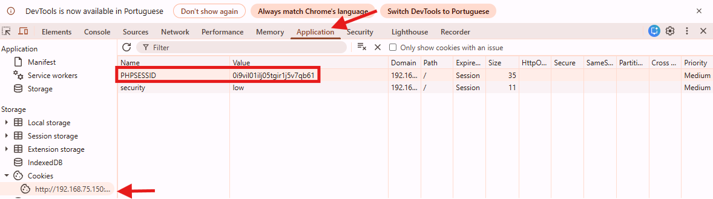

• O que foi feito: Acedeu-se ao painel de desenvolvedor do navegador (tecla F12) na
aba Application/Storage, copiando o identificador único da nossa sessão ativa:
o PHPSESSID=0i9vil01ilj05tgir1j5v7qb61

• O Impacto: Ao passar este token para o SQLMap, ele ganhou passe livre para injetar
payloads diretamente no formulário interno da aplicação, mantendo o nível de
segurança preso em security=low.

#### Passo 1: Descoberta de Bancos de Dados

O primeiro objetivo foi validar se o parâmetro id na URL era de facto explorável e, em caso
positivo, listar os bancos de dados do sistema.

```bash
sqlmap -u "http://127.0.0.1:8081/vulnerabilities/sqli/?id=1&Submit=Submit"   --cookie="PHPSESSID=0i9vil01ilj05tgir1j5v7qb61; security=low" --dbs
```

- `-u`: URL alvo.
- `--cookie`: envia a sessão autenticada.
- `--dbs`: lista as bases de dados.

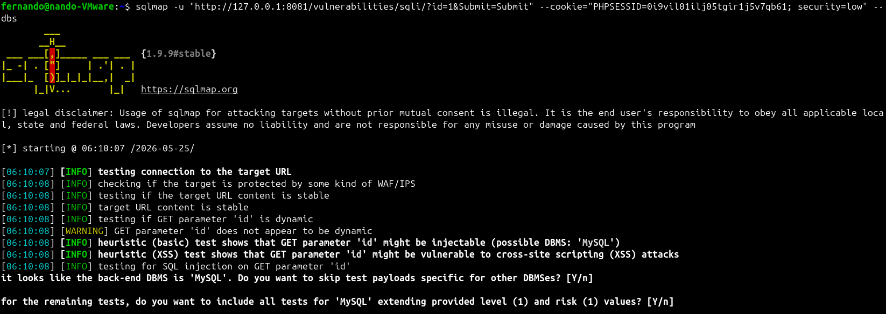

O SQLMap confirmou que a aplicação era vulnerável a múltiplos
tipos de injeção (Blind, Error-based, UNION query) e encontrou duas bases de dados:
o information_schema (Base padrão do MySQL que guarda a estrutura
técnica do servidor).
o dvwa (A base de dados customizada da aplicação, que contém as informações
do negócio)

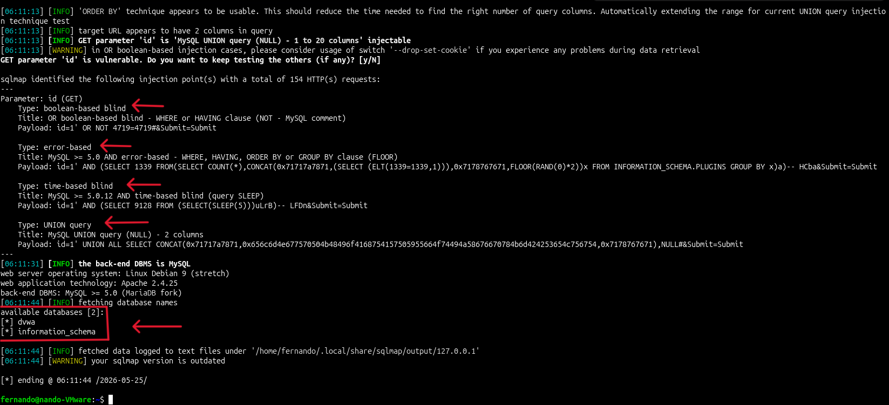

#### Vulnerabilidades de SQL Injection Identificadas

- `boolean-based blind`: perguntas verdadeiro/falso para determinar valores do banco de dados.
- `error-based`: força erros para vazar informações sensíveis.
- `time-based blind`: usa atrasos para confirmar vulnerabilidades quando não há retorno explícito.
- `UNION query`: combina resultados da consulta original com dados adicionados.

O resultado comprovou que a aplicação estava vulnerável e que a exploração permitia acesso a informações sensíveis.


#### Passo 2: Mapeamento de Tabelas

Sabendo que o banco de dados principal se chamava dvwa, o próximo passo lógico foi
descobrir quais tabelas de dados existiam dentro dele.

```bash
sqlmap -u "http://127.0.0.1:8081/vulnerabilities/sqli/?id=1&Submit=Submit"   --cookie="PHPSESSID=0i9vil01ilj05tgir1j5v7qb61; security=low" -D dvwa --tables
```

- `-D dvwa`: define a base de dados alvo.
- `--tables`: lista as tabelas.

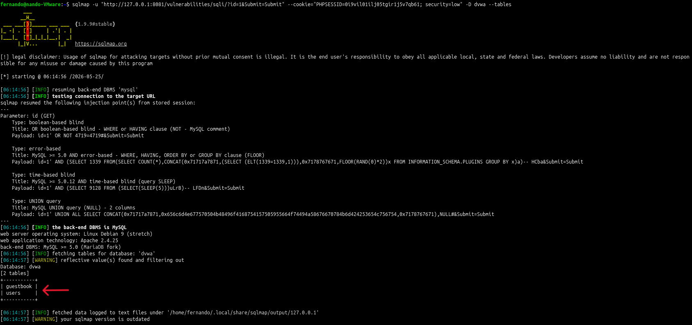

O SQLMap confirmou que a tabela principal existente era `users`.

#### Passo 3: Extração de Dados

Com o alvo perfeitamente identificado (Banco: dvwa | Tabela: users), disparou-se o
comando para extrair todas as informações confidenciais das colunas e linhas.

```bash
sqlmap -u "http://127.0.0.1:8081/vulnerabilities/sqli/?id=1&Submit=Submit"   --cookie="PHPSESSID=0i9vil01ilj05tgir1j5v7qb61; security=low" -D dvwa -T users --dump
```

- `-T users`: define a tabela alvo.
- `--dump`: extrai os dados.

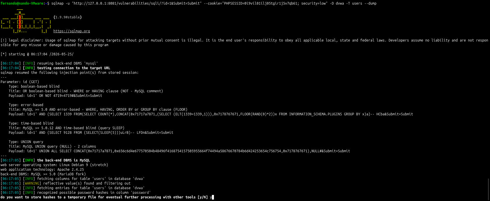

O SQLMap detectou que a coluna `password` estava armazenada como hash MD5. A ferramenta ofereceu opções para armazenar hashes temporariamente e tentar ataques de dicionário para recuperar as senhas.

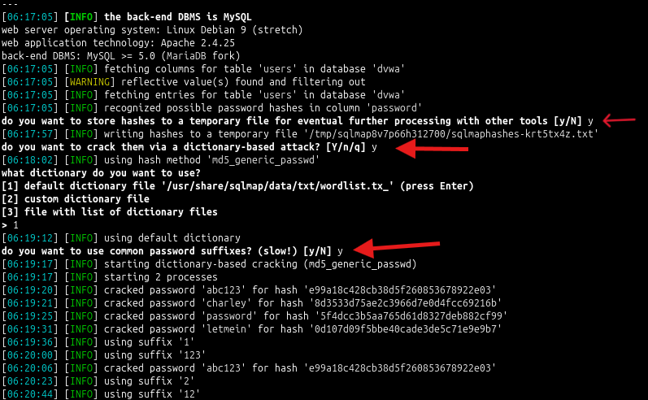

#### Análise Crítica dos Resultados Extraídos

Após processar a quebra das hashes, o SQLMap gerou uma tabela estruturada no terminal,
revelando o banco de dados totalmente exposto.
Abaixo está a análise anatómica do resultado que obtivemos no laboratório:

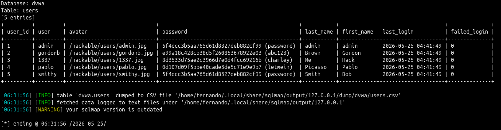

#### O que estes dados provam:

1. A Prova Final sobre o erro do Hydra: Olhando para a tabela extraída pelo SQLMap,
podemos ver as senhas reais quebradas entre parênteses, como password, abc123 e
letmein. Isso é muito interessante porque mata a charada e prova, sem sombra de
dúvida, que aquele 123456 que o Hydra apontou na Fase 3 era mesmo um falsopositivo! As senhas verdadeiras no banco de dados eram outras, confirmando que o
Hydra apenas se perdeu na leitura do erro da página e não tinha descoberto a senha
real.

2. Impacto Máximo de Negócio: Através de um único campo vulnerável na URL, o
atacante conseguiu comprometer a Tríade da Segurança da Informação
(Confidencialidade), extraindo informações confidenciais de utilizadores (nomes,
logins e senhas) sem possuir qualquer privilégio administrativo legítimo.

### Fase 5: Exploração de Command Injection

A funcionalidade `Command Injection` permitia enviar um IP para execução de `ping` no servidor. A entrada não era sanitizada, permitindo concatenar comandos adicionais.

```bash
127.0.0.1 ; cat /etc/passwd
```

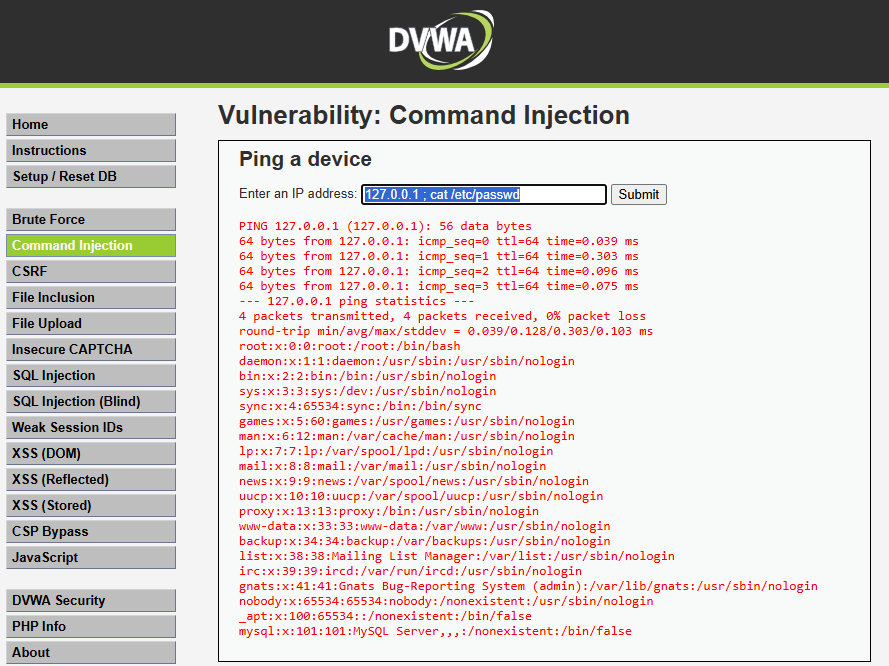

A execução revelou a estrutura de contas do sistema Linux no próprio retorno da página.

### Fase 6: Reconhecimento Avançado e Pós-Exploração

Para validar o impacto real do comprometimento, realizamos uma pós-exploração técnica
encadeando múltiplos utilitários de sistema para coletar o contexto de privilégios (id) e
localização de diretório (pwd).

```bash
127.0.0.1 ; id ; pwd
```

Saída gerada pelo servidor:

```
uid=33(www-data) gid=33(www-data) groups=33(www-data)
/var/www/html/vulnerabilities/exec
```

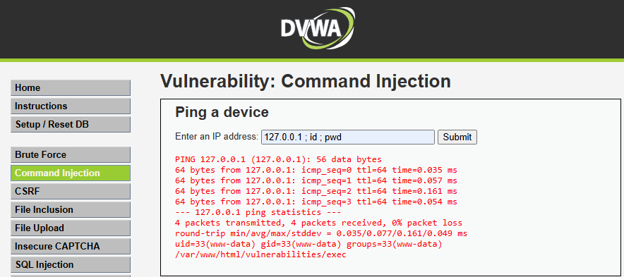

A análise mostrou que o atacante obteve execução remota de código com as permissões do usuário `www-data`. Mesmo sem acesso root, isso permite leitura de código fonte, modificação de arquivos do site e potencial movimentação lateral.

## Aprendizados Adquiridos

- Instalação e isolamento de aplicações web vulneráveis utilizando Docker.
- Compreensão das mecânicas de Port Binding e resolução de conflitos de portas no Linux.
- Automatização da adivinhação de credenciais via Hydra e a importância de políticas de senha fortes.
- Exfiltração de dados de tabelas internas usando SQLMap e o risco da falta de higienização de inputs.
- Exploração prática de falhas de Command Injection (A03:2021 Injection) do OWASP Top 10.
- Compreensão da sintaxe de encadeamento de comandos no Linux para auditoria de segurança.
- Técnicas elementares de pós-exploração para mapeamento de privilégios (`id`) e diretórios (`pwd`).

---

## 🎓 Conclusão
O laboratório cumpriu com sucesso o seu objetivo de demonstrar, de forma prática e controlada, a mecânica por trás de falhas críticas de segurança em aplicações web (AppSec) baseadas no OWASP Top 10. A utilização do Docker para a implantação do ambiente DVWA provou ser uma estratégia eficaz, garantindo o isolamento da aplicação e prevenindo o comprometimento do sistema operacional hospedeiro durante as fases de exploração.

---

## Autor

Fernando Galvão - Projeto desenvolvido como parte do laboratório de estudo de cibersegurança.

**Laboratório realizado em**: Maio 2026

**Propósito**: Educacional / Portfólio