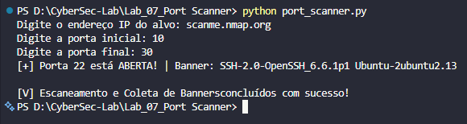

# Lab 07 - Port Scanner em Python

## ⚠️ Aviso de Isenção de Responsabilidade (Disclaimer)
Este projeto foi desenvolvido estritamente para fins educacionais e auditorias de segurança autorizadas. O uso desta ferramenta contra alvos sem autorização expressa é ilegal e viola os princípios da ética hacker.

## Descrição
Este laboratório documenta a implementação de um `port_scanner.py` em Python, capaz de escanear consecutivamente portas TCP em um alvo e coletar banners de serviços quando disponíveis.

---

## Problema Resolvido
O laboratório resolve o desafio de realizar um escaneamento de portas de forma automática e rápida, permitindo identificar serviços expostos em uma máquina remota. Essa técnica é útil na prática para avaliações de segurança, auditorias de rede e descoberta de ativos em ambientes controlados.

---

## Arquitetura e Fluxo do Script
O projeto é simples e opera como um utilitário de linha de comando local.

O script opera seguindo o fluxo abaixo:
1. **Input do Usuário:** Recebe o IP/Domínio alvo e o range de portas.
2. **Alimentação da Fila (`Queue`):** O range de portas é inserido em uma fila thread-safe.
3. **Thread Pool:** Até 100 threads concorrentes são criadas para processar os itens da fila de forma dinâmica.
4. **TCP Handshake (`connect_ex`):** Cada thread tenta estabelecer o aperto de mão de 3 vias (SYN -> SYN-ACK -> ACK).
5. **Banner Grabbing:** Se a conexão retornar código `0` (Aberta), um pacote de provocação (`\r\n`) é enviado para forçar o serviço a expor sua assinatura textual (Banner).

### Componentes
- `port_scanner.py`: script Python que realiza o escaneamento de portas.
- `Images/1.png`: evidência do resultado do escaneamento.
- Alvo remoto ou local: endereço IP definido pelo usuário.

---

## Ferramentas e Tecnologias Aplicadas
- `Python 3.x`
- Biblioteca padrão `socket`
- Biblioteca padrão `threading`
- Biblioteca padrão `queue`
- Windows / Linux (ambiente de execução compatível)

---

## Demonstração de Resultados
### 1️⃣ Executando o scanner
Execute o script no terminal com Python e informe o IP do alvo, a porta inicial e a porta final.

```bash
python port_scanner.py
```

Em seguida, informe:
- `Digite o endereço IP do alvo:`
- `Digite a porta inicial:`
- `Digite a porta final:`

### 2️⃣ Resultado do escaneamento
O script exibe portas abertas e tenta coletar o banner do serviço.



---

## Anatomia da Configuração / Código Principal
| Componente | Explicação |
|---|---|
| `alvo = input(...)` | Recebe do usuário o endereço IP ou hostname do alvo. |
| `porta_inicial`, `porta_final` | Define o intervalo de portas a ser escaneado. |
| `Queue()` | Estrutura de filas para distribuir portas entre threads. |
| `socket.socket(...)` | Cria um socket TCP para testar a conexão em cada porta. |
| `connect_ex((alvo, porta))` | Tenta conectar-se à porta; retorna `0` quando a porta está aberta. |
| `obter_banner(s)` | Envia um CRLF e tenta ler dados retornados pelo serviço na porta. |
| `Thread(target=trabalhador)` | Cria threads para executar o escaneamento de forma concorrente. |
| `fila_portas.join()` | Aguarda a conclusão de todas as portas enfileiradas. |

---

## Aprendizados Adquiridos
- **Conceitos Técnicos Aplicados**
  - Entendimento prático do TCP Three-Way Handshake e como os sistemas operacionais respondem a portas abertas/fechadas.
  - Uso de `socket` para escaneamento TCP.
  - Implementação de concorrência com `threading` e `Queue`.
  - Conceitos de Banner Grabbing e sua importância na fase de enumeração de vulnerabilidades baseada em versões de software.
- **Insights de Segurança/Negócio**
  - Escaneamento de portas é um passo crítico em avaliações de vulnerabilidade.
  - Identificar serviços expostos ajuda a reduzir a superfície de ataque.
  - Ferramentas personalizadas aumentam a flexibilidade em análises específicas.


---

## Notas Importantes
- Execute o script em um ambiente autorizado ou lab controlado.
- Use intervalo de portas adequado para não sobrecarregar o alvo.
- O scanner depende de resposta dos serviços; portas filtradas ou bloqueadas podem não retornar banners.
- Caso o alvo não responda no tempo limite, aumente `s.settimeout(2.0)` conforme necessário.

---

## Conclusão
Este laboratório demonstra a criação de um scanner de portas TCP em Python e a coleta de banners para identificação de serviços. Ele serve como base para desenvolver ferramentas de reconhecimento de rede mais avançadas e aprofundar técnicas de auditoria de segurança.

---

## Autor

Fernando Galvão - Projeto desenvolvido como parte do laboratório de cibersegurança.

**Laboratório realizado em**: 27 de Maio de 2026

**Sistema**: Python 3.x em ambiente de laboratório de cibersegurança

**Propósito**: Educacional / Portfólio