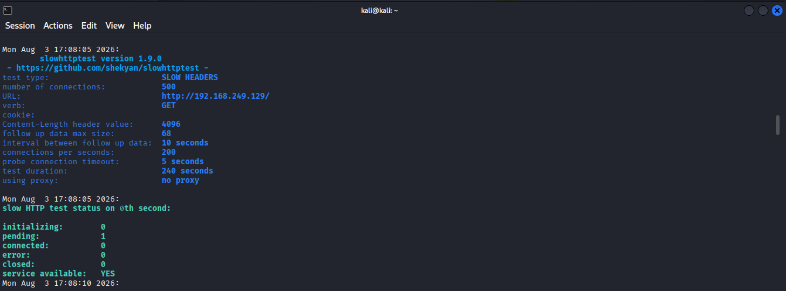
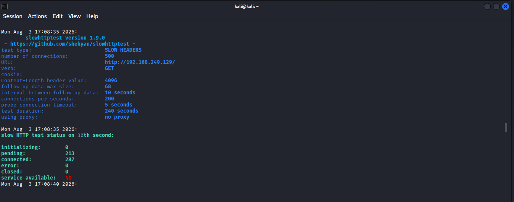
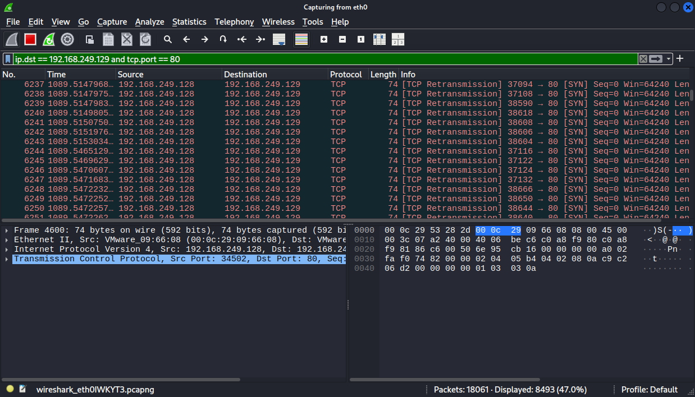
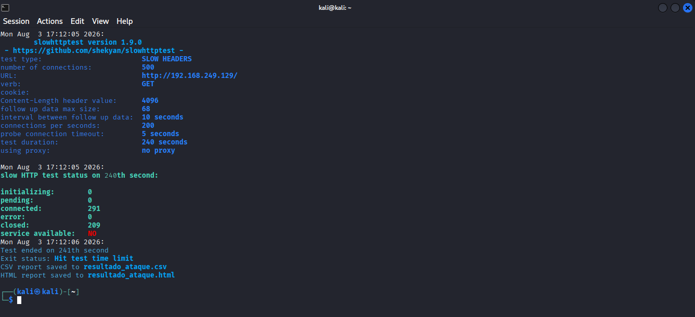

# Simulação e Mitigação de Ataque de Negação de Serviço (DoS) - Slowloris

## Descrição

Laboratório prático focado na **simulação, análise e estratégias de mitigação** de um ataque de Negação de Serviço (DoS) do tipo Slowloris. O objetivo é demonstrar como o esgotamento de conexões simultâneas pode derrubar um servidor web Apache e como estruturar defesas contra essa ameaça.

---

## Problema Resolvido

Servidores web não configurados adequadamente são alvos fáceis para **ataques de exaustão de recursos na camada de aplicação (Camada 7)**. O desafio é entender o comportamento cirúrgico de ferramentas que não dependem de força bruta ou alta largura de banda, testando a resiliência da infraestrutura e planejando controles (como o módulo `mod_reqtimeout`) para garantir a disponibilidade do serviço.

---

## Topologia / Arquitetura

```text
┌─────────────────────────────────────────────────┐
│  Máquina Virtual (Atacante)          │
│  - Kali Linux 2025.2                            │
│  - Ferramenta: slowhttptest                     │
└────────────┬────────────────────────────────────┘
             │
             │ Rede Isolada (NAT / Host-Only)
             │
┌────────────▼────────────────────────────────────┐
│  Máquina Virtual (Alvo)             │
│  - Metasploitable2-Linux                        │
│  - Servidor: Apache (Porta 80)                  │
│  - IP Alvo: 192.168.249.129                     │
└─────────────────────────────────────────────────┘
```

### Componentes:

- **Atacante**: Kali Linux executando ataques de *Slow Headers*.
- **Rede**: Ambiente virtualizado isolado via VMware Workstation.
- **Alvo**: Metasploitable 2 com serviço web Apache vulnerável.

---

## Ferramentas e Tecnologias Aplicadas

- Kali Linux (Atacante) & Linux (Alvo)
- Apache HTTP Server
- `slowhttptest` (Ferramenta de estresse e DoS)
- Redes TCP/IP & Protocolo HTTP
- Virtualização (VMware Workstation)

---

## Demonstração de Resultados

### Passo 1: Identificação do Alvo
Primeiramente, verificamos o endereço IP da máquina alvo (Metasploitable 2) utilizando o comando `ifconfig`.


---

### Passo 2: Verificando a Disponibilidade Inicial do Serviço
Em seguida, acessamos o endereço IP via navegador na máquina atacante para confirmar que o servidor web Apache está respondendo normalmente.


---

### Passo 3: Configuração do Monitoramento
Iniciamos a captura de pacotes na interface de rede com o Wireshark para monitorar o tráfego e analisar o comportamento do ataque.


---

### Passo 4: Filtragem do Tráfego
Aplicamos um filtro no Wireshark focado no IP do alvo para isolar as conexões HTTP pertinentes ao nosso teste.


---

### Passo 5: Instalação da Ferramenta de Ataque
No Kali Linux, instalamos o pacote `slowhttptest` via gerenciador APT:

```bash
$ sudo apt-get update
$ sudo apt-get install slowhttptest
```


---

### Passo 6: Execução do Ataque Slowloris
Disparamos o ataque apontando para o IP do servidor web alvo (192.168.249.129), forçando a abertura simultânea de 500 conexões:

```bash
$ slowhttptest -c 500 -H -g -o resultado_ataque -i 10 -r 200 -t GET -u http://192.168.249.129/
```


**Anatomia do Comando**:

| Componente | Explicação |
|-----------|-----------|
| `-c 500` | Limite de conexões simultâneas a serem abertas |
| `-H` | Modo Slowloris (*Slow Headers*) - Envia requisições incompletas |
| `-g -o` | Gera relatórios estatísticos (CSV e HTML) nomeados "resultado_ataque" |
| `-i 10` | Intervalo de 10 segundos entre o envio de dados (mantém a conexão viva) |
| `-r 200` | Taxa de abertura de 200 conexões por segundo |
| `-u` | URL/IP do servidor web alvo |

---

### Passo 7: Início da Exaustão de Conexões
A ferramenta inicia o envio dos cabeçalhos lentos. Observamos que as conexões começam a ser estabelecidas e retidas pelo ataque.



---

### Passo 8: Progressão do Ataque
O número de conexões ativas e retidas continua aumentando, consumindo gradativamente o pool de conexões do servidor Apache.



---

### Passo 9: Esgotamento Próximo ao Limite
O ataque atinge um estágio crítico onde o servidor recebe a máxima carga de tráfego lento simultâneo, forçando seus recursos.



---

### Passo 10: Detecção de Esgotamento de Recursos e Sucesso do Ataque
O terminal do Kali evidencia o sucesso do ataque. O serviço foi totalmente indisponibilizado:


- **connected: 291**: Conexões ativas sendo retidas pela nossa ferramenta.
- **service available: NO**: O servidor Apache esgotou seu *pool* de conexões disponíveis, negando acesso a novos usuários legítimos.

---

### Passo 11: Consequências Finais no Alvo
Durante os testes extremos, a máquina alvo (Metasploitable 2) pode apresentar suspensão de console (tela preta) e eventuais travamentos por falta de recursos (RAM/Processamento), reflexo direto do estresse imposto pelo ataque de negação de serviço.



---

## Aprendizados Adquiridos

### Conceitos Técnicos Aplicados:

1. **Ataques de Camada 7 (Aplicação)**
   - Diferente de inundações ICMP/UDP, o Slowloris usa pouca largura de banda. Ele foca na manipulação de sessões TCP/HTTP.
2. **Esgotamento de Pool de Conexões**
   - Servidores web possuem um limite máximo de *threads* ou processos de trabalho configurados (ex: `MaxRequestWorkers` no Apache). O ataque captura e bloqueia todas essas requisições.

### Insights de Segurança (Defesa/Blue Team):

- **Mitigação Direta no Apache**: A principal defesa contra Slowloris é implementar e configurar corretamente o módulo **`mod_reqtimeout`**. Ele define um tempo limite estrito para o recebimento de cabeçalhos e corpo HTTP, descartando conexões lentas imediatamente.
- **Filtros e Proxies Reversos**: O uso de serviços WAF ou proxies (como Cloudflare ou NGINX) pode absolver e filtrar ataques de requisições lentas antes que o tráfego atinja o servidor Apache.
- **Monitoramento Contínuo**: Acompanhar picos anômalos de conexões TCP em estado `ESTABLISHED` (via Netstat ou ferramentas de log centralizado) permite responder rapidamente à anomalia.

---

## Comandos Úteis

```bash
# Instalar a ferramenta
$ sudo apt install slowhttptest

# Executar ataque Slowloris (padrão 1000 conexões)
$ slowhttptest -c 1000 -H -i 10 -r 200 -t GET -u http://ALVO/

# Visualizar conexões ativas na porta 80 do servidor (Visão Defensiva)
$ netstat -antp | grep ":80" | grep ESTABLISHED | wc -l

# Reiniciar serviço Apache (caso haja necessidade após o estresse)
$ sudo systemctl restart apache2
```

---

## Notas Importantes

- **Ambiente Isolado**: Este tipo de simulação DoS deve ser executado **estritamente** em redes de laboratório local (Host-Only/NAT).
- **Limitação Estrutural**: O uso de VMs como o Metasploitable 2 facilita a execução acadêmica do ataque, pois o hardware é restrito, acelerando o esgotamento dos recursos para fins de validação e documentação.

---

## Conclusão

Este laboratório evidencia o impacto profundo de ataques na camada de aplicação e como uma falha simples de configuração de _timeout_ compromete a disponibilidade de serviços críticos. Compreender a mecânica ofensiva (Red Team) é essencial para o desenvolvimento de políticas de defesa (Blue Team) mais maduras e de infraestruturas resilientes.

---

**Laboratório realizado em**: Agosto de 2026

**Sistema**: Kali Linux 2025.2 (Ofensiva) vs Metasploitable2-Linux (Defensiva)

**Propósito**: Educacional / Portfólio Profissional - Treinamento em Cibersegurança e Proteção de Infraestrutura Web

## Autor
Fernando Galvão - Projeto desenvolvido como parte do laboratório de estudo de cibersegurança.
