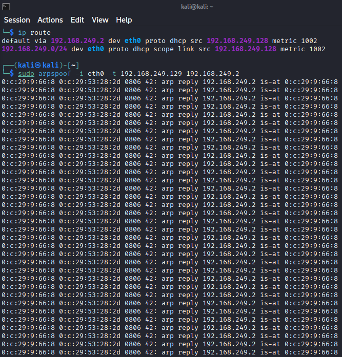
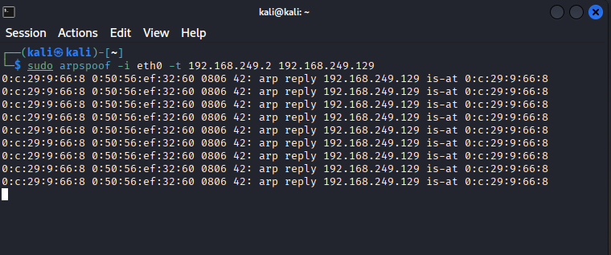
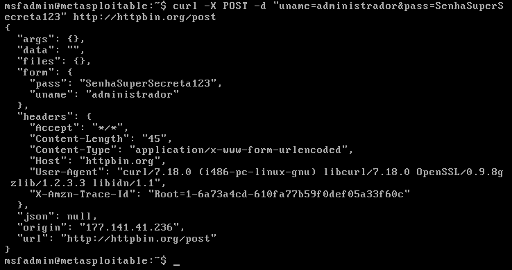
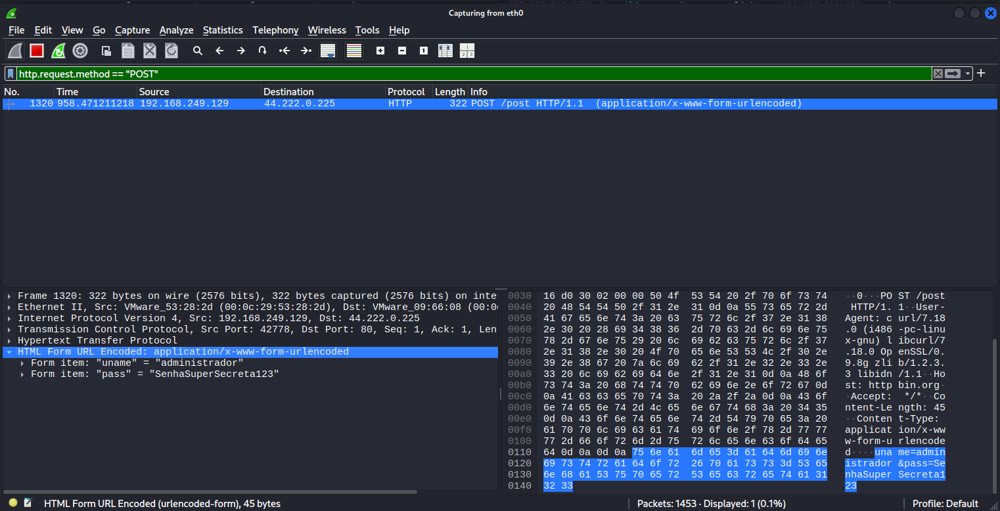

# Análise de Tráfego, Interceptação e Integridade em Rede Local (MITM / ARP Spoofing)

## Descrição

Laboratório prático focado na **simulação, análise forense e execução** de um ataque *Man-in-the-Middle* (MITM) utilizando a técnica de ARP Spoofing. O objetivo deste projeto é demonstrar, em um ambiente de rede local controlada, como o envenenamento de tabelas ARP permite a interceptação silenciosa de tráfego, evidenciando as falhas de segurança na camada de ligação de dados e a fragilidade crítica de comunicações web sem criptografia.

---

## Problema Resolvido

Em redes locais, protocolos legados ou que não exigem autenticação de origem (como o protocolo ARP) confiam cegamente nas respostas recebidas, tornando-se suscetíveis a manipulações maliciosas. Este laboratório resolve a lacuna de compreensão teórica ao comprovar, na prática, como essa vulnerabilidade inerente permite que um agente atue como um "carteiro silencioso". Além disso, evidencia a necessidade absoluta da implementação de protocolos seguros (como HTTPS/TLS) para proteger a confidencialidade e integridade dos dados contra espionagem e alterações em trânsito.

---

## Topologia e Arquitetura

```text
┌─────────────────────────────────────────────────┐
│  Máquina Virtual (Atacante / Auditoria)         │
│  - Kali Linux                                   │
│  - IP Atacante: 192.168.249.128                 │
│  - Interface: eth0                              │
└────────────┬────────────────────────────────────┘
             │
             │ Rede Isolada (NAT - VMware)
             │ Gateway/Roteador: 192.168.249.2
             │
┌────────────▼────────────────────────────────────┐
│  Máquina Virtual (Alvo / Vítima)                │
│  - Metasploitable 2                             │
│  - IP Alvo: 192.168.249.129                     │
└─────────────────────────────────────────────────┘
```

### Componentes:
- **Atacante**: Kali Linux configurado com ferramentas de envenenamento e interceptação.
- **Rede**: Ambiente virtualizado isolado (Rede NAT) via VMware Workstation.
- **Alvo**: Metasploitable 2, gerando tráfego não criptografado.

---

## Ferramentas e Tecnologias Aplicadas

- Kali Linux & Metasploitable 2
- `arpspoof` (Ferramenta para envenenamento da tabela ARP)
- `sysctl` (Manipulação do Kernel Linux para IP Forwarding)
- **Wireshark** (Análise profunda de pacotes - DPI e forense de rede)
- `curl` (Transferência de dados via linha de comando)
- Redes TCP/IP & Camada OSI (Camada 2 e Camada 7)

---

## Demonstração de Resultados

### Passo 1: Mapeamento do Ambiente e IPs
O mapeamento das interfaces ativas e endereçamento foi feito via terminal para identificar o cenário completo. No Kali, utilizou-se `ip a`, e na máquina vítima, `ifconfig`.
- **IP Atacante:** 192.168.249.128


- **IP Vítima:** 192.168.249.129


---

### Passo 2: O "Modo Roteador" (IP Forwarding) e Descoberta do Gateway
Para que a interceptação fosse "invisível" sem derrubar a conexão da vítima, o Kali Linux precisou assumir o papel de roteador. O IP do Gateway (192.168.249.2) foi descoberto analisando a tabela de roteamento.


O encaminhamento de IP foi ativado alterando o kernel em tempo real.


**Anatomia do Comando**:

| Componente | Explicação |
|-----------|-----------|
| `sudo` | Executa o comando com privilégios de administrador (root). |
| `sysctl` | Ferramenta usada para modificar parâmetros do núcleo (kernel) do Linux em tempo de execução. |
| `-w` | Opção de escrita (*write*), indicando que um novo valor será definido em vez de apenas consultado. |
| `net.ipv4.ip_forward` | O parâmetro do kernel responsável por permitir o encaminhamento (roteamento) de pacotes IPv4. |
| `=1` | O valor que ativa o parâmetro (1 = Ligado/Ativado, 0 = Desligado/Desativado). |

---

### Passo 3: O Envenenamento (ARP Spoofing) Bidirecional
Foram enviados pacotes ARP forjados de forma contínua em dois terminais separados.
1. O atacante informa à vítima que seu MAC address pertence ao IP do roteador.



**Anatomia do Comando**:

| Componente | Explicação |
|-----------|-----------|
| `-i eth0` | Define a sua placa de rede |
| `-t 192.168.249.129` | Define o Target (Alvo), que é a Vítima. |
| `192.168.249.2` | É o IP que você está fingindo ser (o Gateway) |  

---
<br>

2. Simultaneamente, o segundo terminal faz exatamente o contrário, engana ao roteador, informando que seu MAC address pertence ao IP da vítima.



O tráfego da vítima agora passa silenciosamente pela interface `eth0` do Kali Linux.

---

### Passo 4: Validação da Interceptação no Wireshark
Iniciamos a captura na interface `eth0` no Wireshark do Kali Linux.


Para validar a captura, a vítima disparou requisições de Ping (ICMP) para a internet.


No Wireshark, utilizando o filtro `icmp`, foi possível monitorar em tempo real os pacotes *Echo request* e *Echo reply* originados do IP da vítima, comprovando o sucesso do ataque *Man-in-the-Middle*.


---

### Passo 5: Interceptação de Credenciais e a Falha de Criptografia
Para demonstrar o risco à confidencialidade, a máquina vítima simulou um login genérico enviando um payload POST para um servidor de testes web sem criptografia SSL/TLS (`httpbin.org`).

O comando executado na máquina vítima:
```bash
curl -X POST -d "uname=administrador&pass=SenhaSuperSecreta123" http://httpbin.org/post
```



---

### Passo 6: Análise Forense e Extração de Dados em Texto Claro
Atuando de forma analítica no Wireshark, aplicamos um filtro restrito para capturar apenas a tentativa de login.
Filtro utilizado: `http.request.method == "POST"`



Expandindo os detalhes da camada de aplicação (`HTML Form URL Encoded`), **o usuário e a senha foram perfeitamente interceptados e lidos em texto claro**, comprovando a exposição total dos dados e o sucesso do ataque voltado à quebra de confidencialidade.

---

## Aprendizados Adquiridos

### Conceitos Técnicos Aplicados:
1. **Funcionamento Inerente do Protocolo ARP:** Compreensão prática de como a tabela ARP traduz IPs para endereços MAC na rede local e como a ausência de autenticação nativa permite o envenenamento (ARP Spoofing).
2. **IP Forwarding (Roteamento Transparente):** Habilidade de manipular variáveis do kernel (`sysctl`) para rotear pacotes de terceiros, garantindo que o ataque não cause Negação de Serviço indesejada na vítima.
3. **Análise de Tráfego:** Criação de filtros cirúrgicos no Wireshark para isolar tráfego HTTP e ICMP em meio a um grande volume de pacotes locais.

### Insights de Segurança (Defesa/Blue Team):
- **Obrigação do TLS/HTTPS:** A demonstração evidencia de forma categórica que qualquer comunicação trafegada em HTTP está totalmente vulnerável a espionagem e alterações na rede local. A criptografia de transporte é o principal pilar de mitigação de leitura.
- **Defesas de Camada 2:** Redes corporativas seguras devem implementar mecanismos mitigatórios nos switches (como *Dynamic ARP Inspection - DAI* e *DHCP Snooping*) para bloquear respostas ARP não solicitadas.

---

## Comandos Úteis

```bash
# Ativar IP Forwarding temporariamente
$ sudo sysctl -w net.ipv4.ip_forward=1

# Descobrir o IP do Gateway Padrão
$ ip route

# Enganar a Vítima (dizendo ser o Roteador)
$ sudo arpspoof -i eth0 -t [IP_VITIMA] [IP_ROTEADOR]

# Enganar o Roteador (dizendo ser a Vítima)
$ sudo arpspoof -i eth0 -t [IP_ROTEADOR] [IP_VITIMA]

# Filtro fundamental no Wireshark para isolar formulários de login
http.request.method == "POST"
```

---

## Notas Importantes

- **Ética e Conformidade:** Este ataque foi realizado estritamente dentro de um laboratório virtualizado e configurado localmente via VMware. Os testes de tráfego externo foram direcionados a sistema de domínio público feito exclusivamente para análise de tráfego (`httpbin.org`).
- A aplicação prática desses conhecimentos tem como objetivo aprimorar estratégias de segurança defensiva, detecção de intrusões e auditoria de redes.

---

## Conclusão

Este laboratório estruturou de ponta a ponta a mecânica de um ataque *Man-in-the-Middle* clássico e extremamente eficaz. Ao transitar da execução dos comandos no terminal Linux até a minuciosa análise visual no Wireshark, ficou validado o impacto devastador que a falta de criptografia apresenta quando aliada à confiança cega de protocolos de camada de ligação. Projetos práticos como este são essenciais para transformar a teoria de redes em capacidades operacionais reais.

---

**Laboratório realizado em:** Agosto de 2026

**Sistema Operacional:** Kali Linux & Metasploitable 2

**Propósito:** Pesquisa e Treinamento Profissional em Segurança Ofensiva e Defensiva

## Autor
Fernando Galvão - Projeto desenvolvido como parte do laboratório de estudo de cibersegurança.
