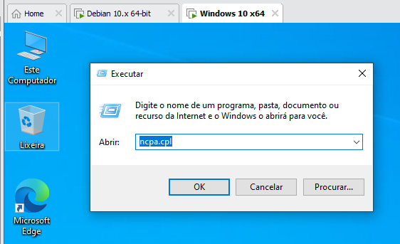
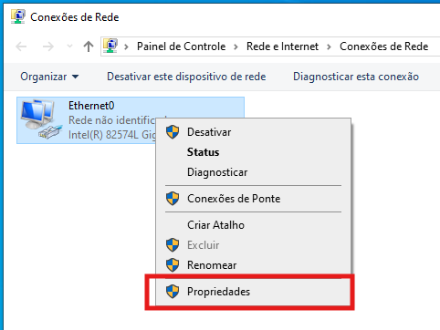

# Construção de Roteador e Firewall de Borda com Linux (Homelab)

## Descrição

Laboratório prático focado na **configuração, roteamento e tradução de endereços (NAT)** utilizando o kernel do Linux. O objetivo deste projeto é demonstrar como transformar uma máquina virtual Debian em um gateway central e firewall de borda, controlando o fluxo de pacotes entre uma rede corporativa isolada e a internet pública.

---

## Problema Resolvido

Redes corporativas exigem que seus dispositivos internos sejam protegidos contra exposições diretas à internet pública, utilizando endereçamento IP privado. Este laboratório resolve a necessidade de conectar esses dispositivos locais à internet de forma segura através de um ponto único de estrangulamento (choke point). Ao aplicar a técnica de NAT (Network Address Translation - Masquerading), garantimos que os pacotes saiam para a rua mascarados com o IP do firewall, protegendo a identidade da máquina cliente e validando o roteamento lógico de pacotes.

---

## Topologia e Arquitetura

```text
┌─────────────────────────────────────────────────┐
│  Máquina Virtual (Gateway / Firewall)           │
│  - Debian 10.13.0                               │
│  - Interface WAN (ens33): NAT (Acesso Externo)  │
│  - Interface LAN (ens36): 192.168.100.1         │
└────────────┬────────────────────────────────────┘
             │
             │ Rede Isolada (LAN Segment / VMnet)
             │ Gateway Padrão: 192.168.100.1
             │
┌────────────▼────────────────────────────────────┐
│  Máquina Virtual (Cliente / Vítima)             │
│  - Windows 10 / 11                              │
│  - Interface LAN única: 192.168.100.10          │
└─────────────────────────────────────────────────┘
```

### Componentes:
- **Firewall/Roteador**: Debian 10.13.0 atuando como *Default Gateway*.
- **Rede**: Ambiente virtualizado estruturado no VMware Workstation com segregação de interfaces (Rede Externa x Rede Interna Isolada).
- **Cliente**: Windows 11 / 10 configurado com IP estático e dependente do firewall para tráfego externo.

---

## Ferramentas e Tecnologias Aplicadas

- VMware Workstation (Configuração de *Virtual Network Editor* e *LAN Segments*)
- Debian GNU/Linux 10
- `iptables` (Manipulação de regras de firewall e NAT no kernel)
- `sysctl` e `/proc/sys/net/ipv4/ip_forward` (Ativação de IP Forwarding)
- `nano` (Edição de arquivos de configuração de rede `/etc/network/interfaces`)
- Prompt de Comando Windows (Troubleshooting e validação ICMP)

---

## Demonstração de Resultados

### Passo 0: Preparação do Ambiente no VMware
Antes das configurações internas, as interfaces de rede foram estruturadas no VMware.


Com as interfaces virtuais prontas, as máquinas Windows (Cliente) e Debian (Firewall) foram iniciadas para configuração.


---

### Passo 1: Reconhecimento e Configuração de Interfaces no Debian
O mapeamento das interfaces foi realizado via terminal do Debian para identificar as placas conectadas. A placa isolada (LAN) foi identificada como `ens36`.


A interface LAN foi configurada com um IP estático editando o arquivo `/etc/network/interfaces`, definindo a máquina como o gateway lógico `192.168.100.1`.


A placa foi ligada com o comando `ifup ens36` e a aplicação do IP foi confirmada via comando `ip a`.


---

### Passo 2: O "Modo Roteador" (IP Forwarding) e Configuração do Cliente
Para que o Debian deixasse de isolar as duas placas e começasse a repassar os pacotes entre elas, o encaminhamento de IP foi ativado alterando o comportamento padrão do kernel.
- Ativação em tempo real: `echo 1 > /proc/sys/net/ipv4/ip_forward`


Para persistência pós-reinicialização, o arquivo `/etc/sysctl.conf` foi alterado.

Descomentamos a linha correspondente ao encaminhamento IPv4, garantindo que o valor seja aplicado no boot.


Em seguida, recarregamos as configurações do kernel utilizando o comando `sysctl -p`.



A confirmação visual no terminal comprovou que o valor de `net.ipv4.ip_forward` assumiu o status ativo (`1`).




Sendo assim, chegamos no momento de configurar a máquina Windows (Cliente).

Na máquina Windows (Cliente), a interface de rede foi configurada manualmente, apontando o tráfego externo para o Debian:
- **IP:** 192.168.100.10
- **Gateway:** 192.168.100.1
- **DNS:** 8.8.8.8 / 1.1.1.1


O teste inicial de ping confirmou a comunicação local entre o Windows e o Debian.


---

### Passo 3: Configuração do NAT com iptables
Com o roteamento ativo, aplicou-se a regra de Masquerading no firewall para traduzir o IP privado do Windows antes de acessar a internet externa.


**Anatomia do Comando**:

| Componente | Explicação |
|-----------|-----------|
| `iptables` | Invoca a ferramenta nativa de gestão de firewall do Linux. |
| `-t nat` | Define a tabela NAT (Network Address Translation) para manipulação. |
| `-A POSTROUTING` | Adiciona a regra na cadeia de pós-roteamento (imediatamente antes do pacote sair da máquina). |
| `-o ens33` | Aplica a regra apenas aos pacotes que saem pela interface de internet (`ens33`). |
| `-j MASQUERADE` | Ação de mascarar o IP de origem privado pelo IP público/externo da interface `ens33`. |

---

### Passo 4: Validação Final (Acesso à Internet)
A partir do Prompt de Comando da máquina Windows isolada, foram realizados disparos de ICMP (ping) para a internet. O tráfego foi roteado com sucesso pelo Debian, mascarado pela regra de NAT e resolvido pelo DNS configurado.

 *(Nota: A validação final definitiva ocorreu dentro da VM Windows).*

---

## Aprendizados Adquiridos

### Conceitos Técnicos Aplicados:
1. **Infraestrutura e Virtualização:** Domínio sobre o isolamento físico/virtual de redes utilizando os recursos avançados de LAN Segments no VMware Workstation.
2. **Manipulação de Kernel e Roteamento:** Compreensão clara de como o Linux gerencia tabelas de roteamento e como o `ip_forward` atua como ponte lógica entre redes distintas.
3. **Engenharia de Firewall e NAT:** O conceito de Masquerading na prática. Entendimento da diferença de tráfego de entrada (Inbound) e saída (Outbound), transformando um entendimento teórico de redes em habilidade operacional executável via CLI.

### Insights de Carreira e Formação:
Este laboratório consolida diretamente os fundamentos de infraestrutura necessários para a progressão profissional em Segurança da Informação. Dominar a criação manual de roteamentos e regras de `iptables` fortalece a base acadêmica do 3º semestre em Segurança da Informação (SENAC), facilitando o rápido aprendizado futuro em firewalls corporativos de interface gráfica (Next-Generation Firewalls como Fortinet, Palo Alto ou pfSense).

---

## Comandos Úteis

```bash
# Verificar status das interfaces de rede
$ ip a

# Ligar ou desligar uma interface específica
$ sudo ifup [interface]
$ sudo ifdown [interface]

# Ativar roteamento no kernel em tempo real
$ echo 1 > /proc/sys/net/ipv4/ip_forward

# Tornar o roteamento permanente (descomentar net.ipv4.ip_forward=1)
$ sudo nano /etc/sysctl.conf
$ sudo sysctl -p

# Criar regra de NAT (Masquerading) para a interface de saída (ex: ens33)
$ sudo iptables -t nat -A POSTROUTING -o ens33 -j MASQUERADE

# Listar as regras ativas na tabela NAT
$ sudo iptables -t nat -L -v -n
```

---

## Notas Importantes

- **Ética e Conformidade:** Laboratório executado em ambiente 100% *Homelab* controlado. Todas as regras de tráfego e simulações afetam apenas o segmento local privado virtualizado.
- O desenvolvimento das habilidades descritas neste projeto é focado estritamente na construção de arquiteturas defensivas (Blue Team) e no entendimento profundo da engenharia de redes para formação técnica sênior.

---

## Conclusão

A execução deste projeto estabelece os alicerces primordiais de redes e segurança defensiva. A transição de um simples terminal Debian para o "cérebro" de tráfego de uma rede demonstra o poder do controle em baixo nível. Esta base sólida de roteamento é o pré-requisito técnico que sustenta os próximos avanços na trilha, como filtragem rigorosa de acessos (Egress Filtering), sistemas de detecção de intrusão (IDS) e interceptação avançada de pacotes.

---

**Laboratório realizado em:** Agosto de 2026

**Sistema Operacional:** Debian 10.13.0 & Windows 10/11

**Propósito:** Construção de Portfólio e Treinamento Prático em Engenharia de Segurança

## Autor
**Fernando Galvão**
*Projeto desenvolvido como parte do laboratório de práticas em Segurança da Informação e Cibersegurança.*
