# Implementação de Controle de Perímetro e Egress Filtering com Squid Proxy

Este repositório documenta a implementação prática de um servidor de borda utilizando o **Squid Web Proxy** no Linux Debian 10. O projeto simula um ambiente corporativo focado em controle de tráfego de saída (*egress filtering*), implementação de regras de acesso (ACLs) granulares para domínios e termos, auditoria via logs estruturados e uma análise técnica aprofundada sobre as limitações de inspeção em conexões criptografadas (HTTPS/TLS).

---

## Topologia do Laboratório

```text
       [ Internet ]
            ▲
            │ (NAT / Conexão WAN)
    ┌───────┴────────┐
    │  Debian 10.x   │  IP WAN: 192.168.249.131/24 (ens33)
    │ (Squid Proxy)  │  IP LAN: 192.168.100.1/24   (ens36)
    └───────▲────────┘  Porta de Serviço: 3128
            │
            │ (Rede Local VMnet / 192.168.249.0/24)
    ┌───────┴────────┐
    │  Windows 10    │
    │ (Client Host)  │  IP: 192.168.249.135/24
    └────────────────┘
```

| Máquina | Sistema Operacional | Função / Configuração |
| :--- | :--- | :--- |
| **Servidor** | Debian 10.x (Buster) | Servidor Squid Proxy (Porta 3128) |
| **Cliente** | Windows 10 x64 | Endpoint corporativo apontando para o proxy |

---

## 1. Mapeamento de Redes e Interfaces

Antes da instalação dos serviços, validou-se o endereçamento IP entre o nó servidor e o endpoint cliente.

* **Debian 10 (Servidor):**
  * `ens33`: `192.168.249.131/24`
  * `ens36`: `192.168.100.1/24`


* **Windows 10 (Cliente):**
  * `Ethernet0`: `192.168.249.135/24`


---

## 2. Instalação e Preparação do Ambiente

A instalação dos pacotes e o backup das definições de fábrica do Squid foram executados via terminal:

```bash
# Atualização dos repositórios
apt update

# Instalação do serviço Squid
apt install -y squid

# Criação de backup da configuração padrão
cd /etc/squid
cp squid.conf squid.conf.bkp
```

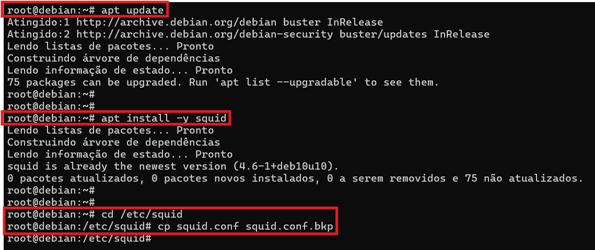

Em seguida, foi criada a estrutura de diretórios para armazenar as listas de regras customizadas:

```bash
# Criação do diretório para arquivos de políticas
mkdir -p /etc/squid/regras
```

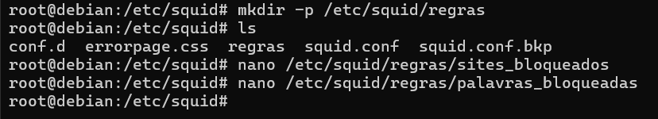

---

## 3. Definição das Listas de Controle de Acesso (ACLs)

Foram criados dois arquivos distintos para segmentar as políticas de negação:

### A. Bloqueio por Domínio (`sites_bloqueados`)
Arquivo: `/etc/squid/regras/sites_bloqueados`
```text
facebook.com
instagram.com
tiktok.com
```
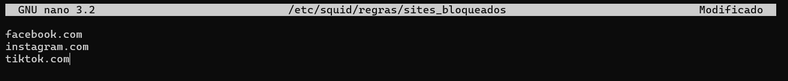

### B. Bloqueio por Expressão Regular/Termo (`palavras_bloqueadas`)
Arquivo: `/etc/squid/regras/palavras_bloqueadas`
```text
aposta
cassino
porn
jogos
```
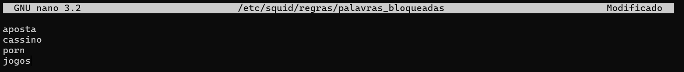

---

## 4. Configuração do Squid (`squid-senac.conf`)

Um arquivo de configuração enxuto e estruturado foi implementado para garantir a aplicação estrita da ordem das diretivas de segurança:

```apache
# Porta padrão de escuta
http_port 3128

# Identificação do host
visible_hostname proxy-senac

# ================================
# ACLs Padrões e Portas Seguras
# ================================
acl SSL_ports port 443
acl Safe_ports port 80          # HTTP
acl Safe_ports port 21          # FTP
acl Safe_ports port 443         # HTTPS
acl Safe_ports port 1025-65535  # Portas não registradas
acl CONNECT method CONNECT

# Bloqueio de portas perigosas
http_access deny !Safe_ports
http_access deny CONNECT !SSL_ports

# ================================
# Definição de Redes e Listas
# ================================
acl rede_local src 192.168.249.0/24 192.168.100.0/24
acl sites_bloqueados dstdomain "/etc/squid/regras/sites_bloqueados"
acl palavras_bloqueadas url_regex -i "/etc/squid/regras/palavras_bloqueadas"

# ================================
# Aplicação de Políticas de Acesso
# ================================
# 1. Bloqueios explícitos (Prioridade Alta)
http_access deny sites_bloqueados
http_access deny palavras_bloqueadas

# 2. Liberação controlada da rede local
http_access allow rede_local
http_access allow localhost

# 3. Negação implícita de segurança
http_access deny all

# ================================
# Logs e Cache
# ================================
access_log /var/log/squid/access.log squid
cache_mem 64 MB
maximum_object_size 4096 KB
```

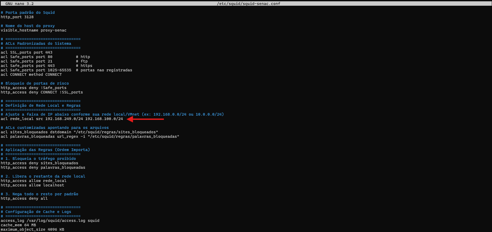

#### Anatomia das Diretivas de Configuração (`squid.conf`)

| Diretiva / Parâmetro | Tipo | Finalidade e Comportamento Técnico |
| :--- | :--- | :--- |
| `http_port 3128` | Conexão de Rede | Define o socket TCP em que o daemon do Squid escuta as requisições enviadas pelos navegadores/clientes. |
| `visible_hostname proxy-senac` | Identificação | Nome de host exibido nas mensagens de cabeçalho HTTP e páginas corporativas de erro (ex: página de 403 Forbidden). |
| `acl SSL_ports port 443` | ACL de Porta | Cria a lista de portas autorizadas para conexões cifradas (HTTPS/TLS). |
| `acl Safe_ports port <portas>` | ACL de Porta | Define as portas padrão de serviços seguros permitidos (80 HTTP, 21 FTP, 443 HTTPS, portas altas não registradas). |
| `acl CONNECT method CONNECT` | ACL de Método | Identifica requisições que utilizam o método HTTP `CONNECT`, essencial para criar o túnel TCP em sessões HTTPS/TLS. |
| `http_access deny !Safe_ports` | Regra de Acesso | Bloqueia preventivamente qualquer requisição direcionada a portas fora da lista de portas seguras (`!Safe_ports`). |
| `http_access deny CONNECT !SSL_ports` | Regra de Acesso | Impede que o método `CONNECT` seja utilizado para tunelar conexões em portas não seguras (previne uso do proxy como relay arbitrário). |
| `acl rede_local src <redes>` | ACL de Origem (`src`) | Mapeia os blocos de endereçamento IP de origem autorizados a utilizar o proxy corporativo. |
| `acl sites_bloqueados dstdomain <arquivo>` | ACL de Destino (`dstdomain`) | Carrega a lista externa de domínios completos a serem bloqueados na camada de destino. |
| `acl palavras_bloqueadas url_regex -i <arquivo>` | ACL de Padrão (`url_regex`) | Lê lista de expressões regulares para inspecionar strings no corpo da URL (o parâmetro `-i` torna a busca *case-insensitive*). |
| `http_access deny sites_bloqueados` | Política de Acesso | Nega o acesso imediato caso a requisição bata com um domínio proibido (ordem de prioridade *top-down*). |
| `http_access deny palavras_bloqueadas` | Política de Acesso | Nega o tráfego caso a URL em texto claro contenha qualquer um dos termos proibidos. |
| `http_access allow rede_local` | Política de Acesso | Libera a navegação dos hosts da rede local para todos os destinos e termos não barrados pelas regras anteriores. |
| `http_access deny all` | Política Padrão | Regra de *Default Deny* (Negação Implícita), garantindo que origens não autorizadas sejam rejeitadas. |
| `access_log /var/log/squid/access.log squid` | Auditoria / Log | Define o caminho em disco e o formato nativo para gravação de todas as transações HTTP/HTTPS processadas. |
| `cache_mem 64 MB` / `maximum_object_size` | Performance | Aloca limite de memória RAM e define tamanho máximo de objetos estáticos para cache local. |

---

### Validação Sintática e Inicialização

O arquivo foi aplicado e checado contra erros estruturais antes de reiniciar o daemon:

```bash
# Sobrescrever arquivo de produção
cp /etc/squid/squid-senac.conf /etc/squid/squid.conf

# Testar sintaxe
squid -k parse
```

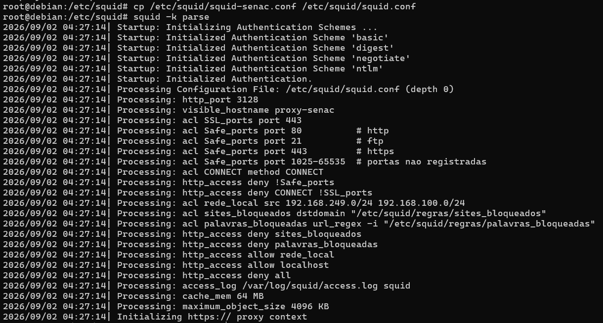

**Anatomia do Comando (`squid -k parse`):**

| Parâmetro / Opção | Função |
| :--- | :--- |
| `squid` | Executável principal do serviço de proxy web. |
| `-k parse` | Envia um sinal de verificação estrita de sintaxe no arquivo de configuração ativo, apontando erros de digitação, caminhos inexistentes ou conflitos de diretiva antes da execução em produção. |

```bash
# Reiniciar e verificar o serviço
systemctl restart squid
systemctl status squid
```

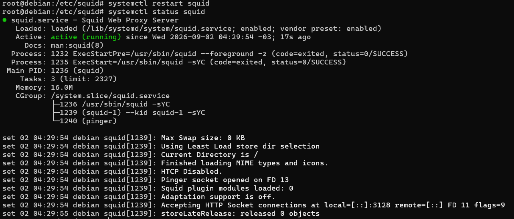

**Anatomia dos Comandos (`systemctl`):**

| Comando | Função |
| :--- | :--- |
| `systemctl restart squid` | Reinicia completamente o processo do daemon do Squid via gerenciador de serviços do Linux (systemd), carregando a nova configuração e liberando sockets de rede. |
| `systemctl status squid` | Consulta o estado operacional do serviço em tempo real, informando PID principal, status `active (running)`, consumo de memória e mensagens de inicialização do journal. |

---

## 5. Configuração no Endpoint Cliente

No cliente Windows 10, o proxy manual foi configurado globalmente nas definições de rede apontando para o servidor:
* **Endereço:** `192.168.249.131`
* **Porta:** `3128`

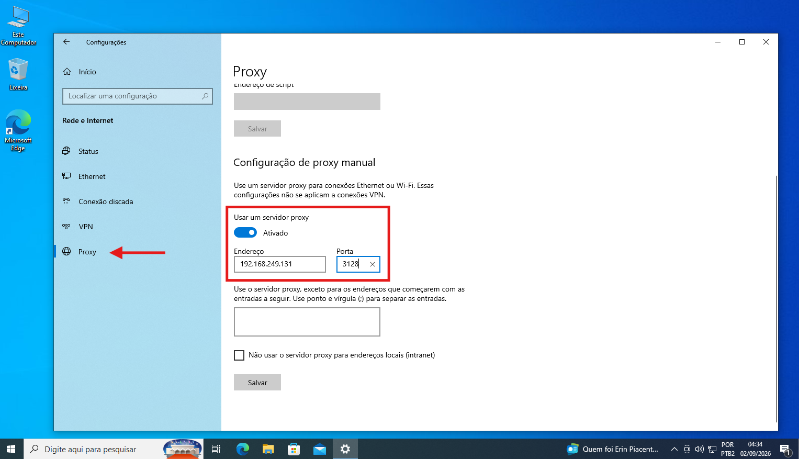

---

## 6. Testes Práticos e Validação de Políticas

### Cenário 1: Tráfego Permitido (Navegação Padrão)
O acesso a portais de notícias não catalogados nas listas de bloqueio (ex: `https://www.uol.com.br`) funcionou sem interrupções.


---

### Cenário 2: Bloqueio por Domínio (`dstdomain`)
A tentativa de conexão ao domínio `tiktok.com` foi barrada na camada de borda pelo Squid, exibindo a página corporativa de **Acesso Negado (HTTP 403 Forbidden)**.

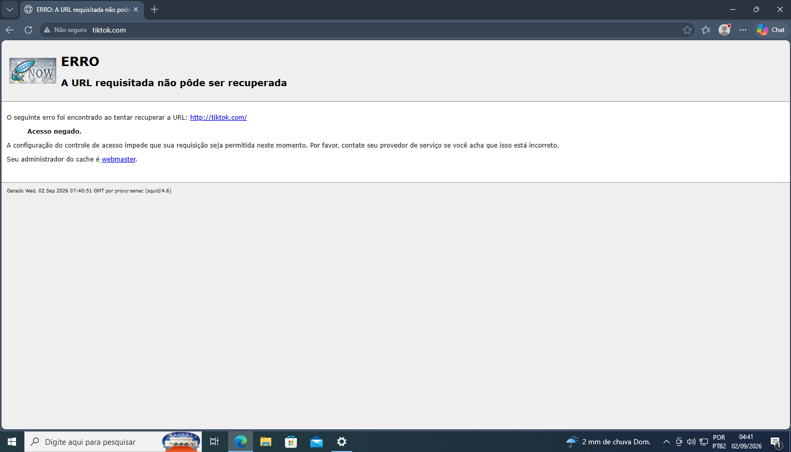

---

### Cenário 3: Bloqueio por Palavras via HTTP (`url_regex`)
A tentativa de navegação na URL `http://neverssl.com/aposta` disparou imediatamente a regra baseada em expressões regulares, bloqueando a requisição antes de atingir o servidor de origem.

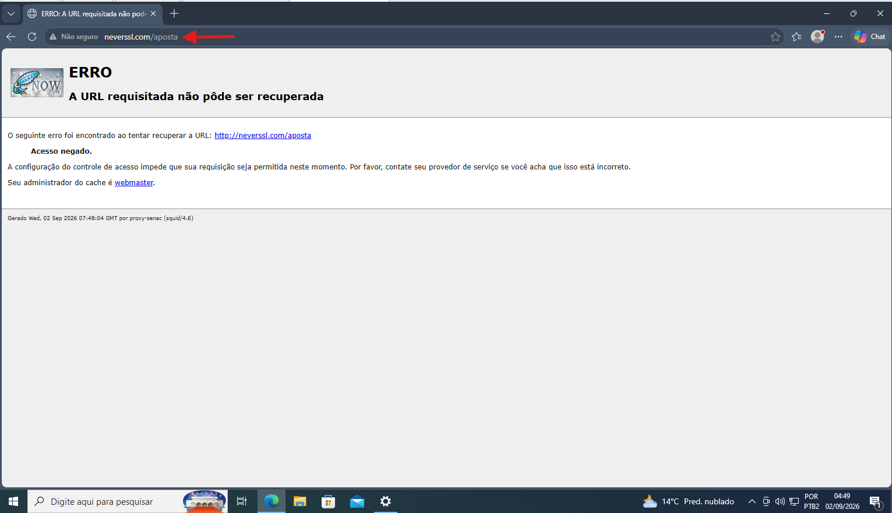

---

## 7. Análise Técnica: Por que o bloqueio de palavras falhou no HTTPS?

Durante o laboratório, observou-se que a busca pelo termo `aposta` diretamente no Google (`https://www.google.com/search?q=aposta`) **não foi bloqueada** pelo proxy:


### Causa Raiz (Mecanismo do TLS / HTTPS)
1. **Túnel HTTP CONNECT:** Quando o cliente acessa um site HTTPS, ele envia uma solicitação `CONNECT google.com:443` ao Squid.
2. **Criptografia Fim a Fim:** Assim que o túnel é estabelecido, toda a negociação de criptografia (TLS handshake), caminhos de URL (`/search`), parâmetros de query (`?q=aposta`) e corpo da requisição trafegam cifrados entre o navegador do usuário e os servidores do destino.
3. **Visibilidade Limitada do Proxy:** O Squid em modo clássico enxerga apenas o **domínio de destino** (através do SNI / CONNECT). Ele não possui visibilidade de camada de aplicação (L7) sobre o conteúdo cifrado para acionar a ACL `url_regex`.
4. **Resolução em Cenários Corporativos:** Para inspecionar termos dentro de URLs HTTPS com Squid, seria necessário habilitar o **SSL Bumping** (interceptação TLS/Man-in-the-Middle com geração e distribuição de uma CA raiz confiável para todas as máquinas clientes).

---

## 8. Auditoria de Logs em Tempo Real

No terminal do Debian, o log de auditoria confirmou a efetividade do bloqueio no nível da aplicação:

```bash
tail -f /var/log/squid/access.log
```

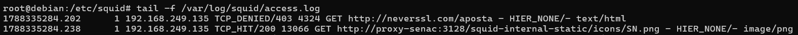

* **Entrada Registrada:**
  ```text
  1788335284.202      1 192.168.249.135 TCP_DENIED/403 4324 GET http://neverssl.com/aposta - HIER_NONE/- text/html
  ```
* **Significado:** O IP cliente `192.168.249.135` requisitou uma URL contendo o termo proibido via método `GET`. O Squid respondeu com status `TCP_DENIED/403`, interrompendo o ciclo de entrega de pacotes.

---

## Conclusões e Abordagens no Mercado Moderno

Embora o Squid permaneça como uma ferramenta didática para assimilação de políticas de listas de controle de acesso (ACLs) e controle de tráfego de saída (*egress filtering*), os ambientes corporativos atuais migraram suas estratégias de defesa de borda:

* **Next-Generation Firewalls (NGFW):** Soluções como Fortinet FortiGate e Palo Alto realizam filtragem baseada em categorias e decodificação profunda de pacotes (DPI) diretamente no hardware sem exigir proxies HTTP explícitos.
* **Filtragem de Camada DNS:** Ferramentas como Cisco Umbrella, Cloudflare Zero Trust e Pi-hole bloqueiam destinos maliciosos na resolução de nomes, contornando a complexidade da interceptação HTTPS.
* **Arquiteturas SASE / SSE:** Adoção de agentes de borda distribuídos em nuvem (ex: Zscaler, Netskope) que protegem endpoints fora do perímetro tradicional do escritório.

---

**Laboratório realizado em:** Setembro de 2026

**Sistema Operacional:** Debian 10(buster) & Windows 10

**Propósito:** Construção de Portfólio e Treinamento Prático

## Autor
**Fernando Galvão**
*Projeto desenvolvido como parte do laboratório de práticas em Segurança da Informação e Cibersegurança.*