# Implementação de VPN Client-to-Site com OpenVPN

Este laboratório documenta a prática de criação de uma **Rede Privada Virtual (VPN)** do tipo *Client-to-Site* utilizando o **OpenVPN** no Linux Debian 10 (Servidor) e no Kali Linux (Cliente).

O objetivo deste projeto foi entender na prática como funciona o acesso remoto seguro: como criar uma Autoridade Certificadora (CA) própria, gerar certificados digitais e chaves criptográficas com o `easy-rsa`, configurar o servidor e o cliente, e fechar um túnel criptografado para comunicação entre as duas máquinas.

---

## Topologia do Laboratório

```text
       [ Rede Local / Host ]
                 ▲
                 │ (Comunicação WAN/Bridged/NAT)
    ┌────────────┴───────────┐
    │  Debian 10.x (Servidor)│  IP WAN: 192.168.249.131 (ens33)
    │  - OpenVPN Server      │  Rede VPN Virtual: 10.5.0.0/24
    │  - Autoridade (CA)     │  Porta de Serviço: 1194 (UDP)
    └────────────▲───────────┘
                 │
                 │ (Túnel Criptografado OpenVPN)
    ┌────────────┴───────────┐
    │  Kali Linux (Cliente)  │
    │  - OpenVPN Client      │  IP Virtual Recebido: 10.5.0.6
    └────────────────────────┘
```

| Máquina | Sistema Operacional | Função no Laboratório |
| :--- | :--- | :--- |
| **Servidor** | Debian 10.x (Buster) | Servidor OpenVPN e Autoridade Certificadora (CA) |
| **Cliente** | Kali Linux | Dispositivo remoto que se conecta à VPN (*Client-to-Site*) |

---

## 1. Instalação e Preparação do Ambiente

O primeiro passo foi atualizar a lista de pacotes do Debian e instalar o pacote do OpenVPN:

```bash
# Atualização dos repositórios
apt-get update

# Instalação do OpenVPN
apt-get install openvpn

# Verificando a pasta de configuração criada
cd /etc/openvpn
ls -l
```

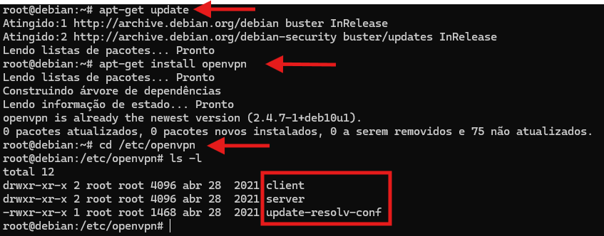

A instalação cria a estrutura padrão em `/etc/openvpn`, contendo as pastas `client` e `server`.

---

## 2. Infraestrutura de Chaves (PKI) e Criação da CA

Para que o OpenVPN funcione com segurança, ele utiliza certificados digitais (infraestrutura PKI). Isso garante que apenas clientes com certificados válidos e assinados pela nossa CA consigam se conectar.

Para facilitar a geração dos certificados, utilizamos a ferramenta `easy-rsa`:

```bash
# Copiando os scripts do easy-rsa para a pasta do OpenVPN
cp -r /usr/share/easy-rsa /etc/openvpn
cd /etc/openvpn/easy-rsa

# Inicializando a estrutura de chaves (PKI)
./easyrsa init-pki
```

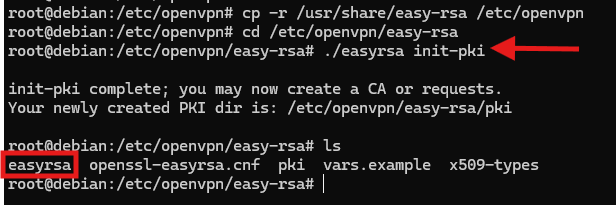

Em seguida, criamos a nossa **Autoridade Certificadora (CA)** mestre. Ela é a entidade responsável por assinar tanto o certificado do servidor quanto o dos clientes.

```bash
# Criação da CA (Autoridade Certificadora)
./easyrsa build-ca
```

Durante a criação, definimos uma senha para proteger a chave da CA e inserimos o nome comum (*Common Name*): `OpenVPN`.

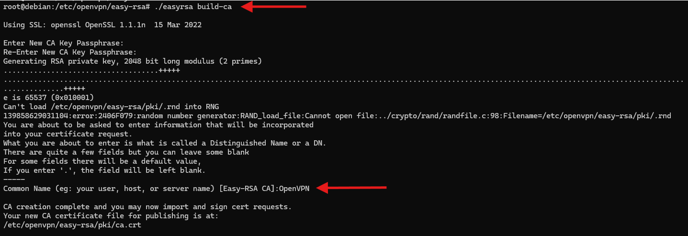

O certificado público da CA foi gerado em `/etc/openvpn/easy-rsa/pki/ca.crt`.

---

## 3. Geração e Assinatura dos Certificados

Com a CA pronta, o próximo passo foi gerar os certificados e chaves para o servidor e para o cliente.

### A. Certificado do Servidor (`OpenVPN`)

Geramos a requisição de certificado (CSR) e a chave privada do servidor com o parâmetro `nopass` (sem senha), para que o serviço consiga iniciar sozinho no boot sem travar pedindo senha:

```bash
# Gerando a chave privada e a requisição do servidor
./easyrsa gen-req OpenVPN nopass
```

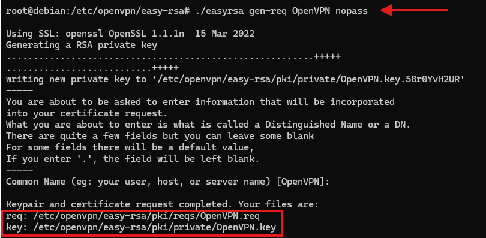

Depois, assinamos a requisição do servidor utilizando a nossa CA:

```bash
# Assinando o certificado do servidor com a CA
./easyrsa sign-req server OpenVPN
```

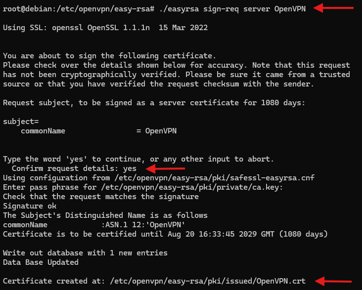

Para confirmar que o certificado foi assinado corretamente e é confiável, realizamos a verificação com o comando `openssl verify`:

```bash
# Validando o certificado contra a CA
openssl verify -CAfile /etc/openvpn/easy-rsa/pki/ca.crt pki/issued/OpenVPN.crt
```


O retorno `OK` confirma que a cadeia de certificados está correta.

---

### B. Certificado do Cliente (`client01`)

Repetimos o processo para criar as credenciais do cliente remoto (`client01`):

```bash
# Gerando a chave privada e requisição do cliente
./easyrsa gen-req client01 nopass
```

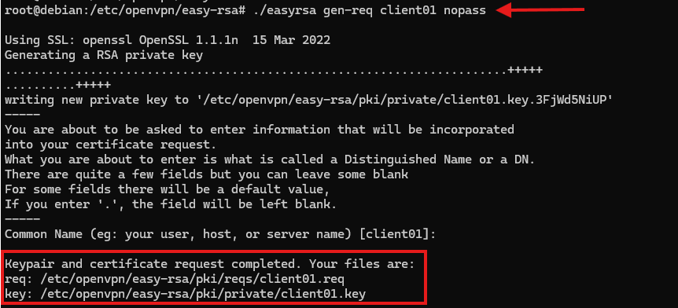

Em seguida, assinamos o certificado do cliente com a CA e validamos a assinatura:

```bash
# Assinando o certificado do cliente
./easyrsa sign-req client client01

# Verificando a validade do certificado
openssl verify -CAfile /etc/openvpn/easy-rsa/pki/ca.crt pki/issued/client01.crt
```

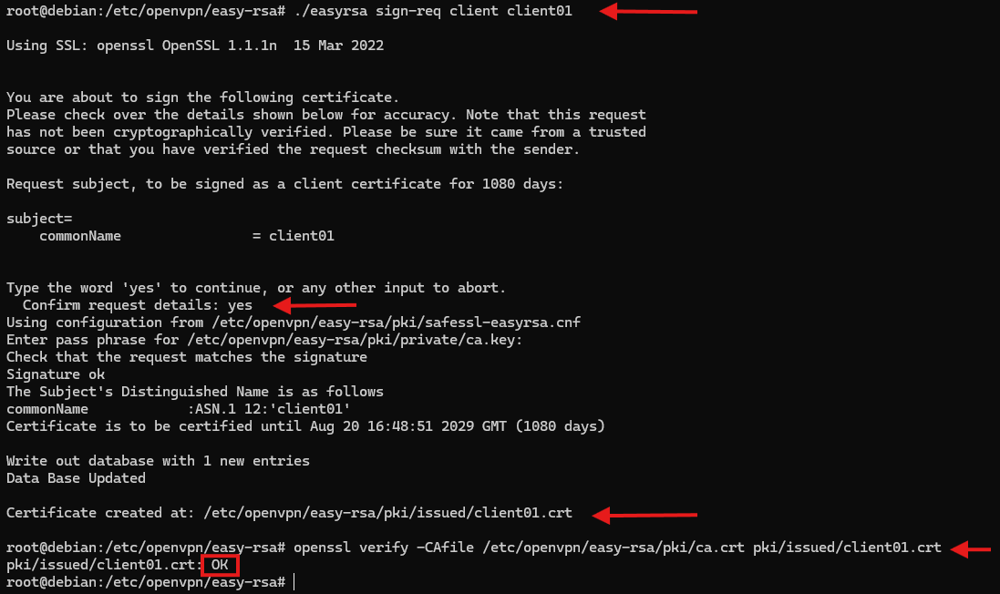

---

### C. Geração dos Parâmetros Diffie-Hellman (`dh.pem`)

O **Diffie-Hellman** é um método criptográfico que permite que o servidor e o cliente combinem uma chave secreta compartilhada pela rede sem precisar transmiti-la diretamente.

```bash
# Gerando os parâmetros Diffie-Hellman de 2048 bits
./easyrsa gen-dh
```


O arquivo gerado foi salvo em `/etc/openvpn/easy-rsa/pki/dh.pem`.

---

## 4. Configuração do Servidor OpenVPN (`server.conf`)

Criamos o arquivo de configuração do servidor em `/etc/openvpn/server/server.conf`:

```apache
port 1194
proto udp
dev tun
ca /etc/openvpn/easy-rsa/pki/ca.crt
cert /etc/openvpn/easy-rsa/pki/issued/OpenVPN.crt
key /etc/openvpn/easy-rsa/pki/private/OpenVPN.key
dh /etc/openvpn/easy-rsa/pki/dh.pem
server 10.5.0.0 255.255.255.0
keepalive 20 60
persist-key
persist-tun
compress lz4
daemon
user nobody
log-append /var/log/openvpn.log
verb 3
```

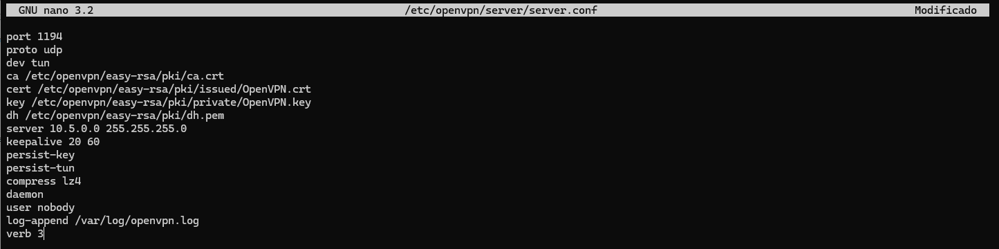

#### O que cada linha do `server.conf` faz:

| Parâmetro | Explicação Simples |
| :--- | :--- |
| `port 1194` | Porta padrão onde o OpenVPN fica escutando conexões. |
| `proto udp` | Usa UDP, que é mais rápido e ideal para tráfego de VPN. |
| `dev tun` | Cria uma interface de túnel virtual (modo roteado camada 3). |
| `ca / cert / key / dh` | Aponta os caminhos dos arquivos de segurança que geramos anteriormente. |
| `server 10.5.0.0 255.255.255.0` | Define a faixa de IP que será distribuída para os clientes conectados. |
| `keepalive 20 60` | Testa a conexão a cada 20 segundos; se ficar 60s sem resposta, considera desconectado. |
| `persist-key / persist-tun` | Mantém a chave e o túnel ativos mesmo se o serviço reiniciar. |
| `compress lz4` | Ativa compressão para economizar dados e acelerar a transferência. |
| `daemon` | Faz o OpenVPN rodar em segundo plano no Linux. |
| `user nobody` | Roda o serviço com um usuário sem privilégios para aumentar a segurança. |
| `log-append /var/log/openvpn.log` | Guarda o histórico de eventos e conexões em arquivo de log. |
| `verb 3` | Nível de detalhes dos logs (médio, bom para acompanhar o que acontece). |

---

### Inicializando o Serviço no Debian

Iniciamos o serviço com o `systemctl` e checamos se estava tudo rodando normalmente:

```bash
# Iniciar o servidor OpenVPN
systemctl start openvpn-server@server

# Verificar se está ativo
systemctl status openvpn-server@server
```

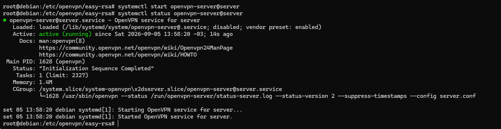

O status `active (running)` e a mensagem `Initialization Sequence Completed` confirmam que o servidor subiu com sucesso.

---

## 5. Configuração do Cliente (Kali Linux)

No Kali Linux, criamos uma pasta para organizar os arquivos de conexão da VPN:

```bash
# Criando a pasta do cliente
mkdir ~/vpn-lan
cd ~/vpn-lan
```

Copiamos do servidor para essa pasta os seguintes arquivos:
1. `ca.crt` (Certificado da CA para o cliente confiar no servidor)
2. `client01.crt` (Certificado de identificação do cliente)
3. `client01.key` (Chave privada do cliente)

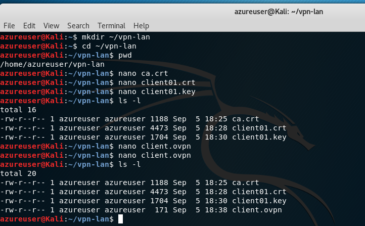

---

### Arquivo de Conexão (`client.ovpn`)

Criamos o arquivo `client.ovpn` na mesma pasta com as instruções de conexão:

```apache
client
dev tun
proto udp
remote 192.168.249.131 1194
ca ca.crt
cert client01.crt
key client01.key
resolv-retry infinite
compress lz4
nobind
persist-key
persist-tun
verb 3
```

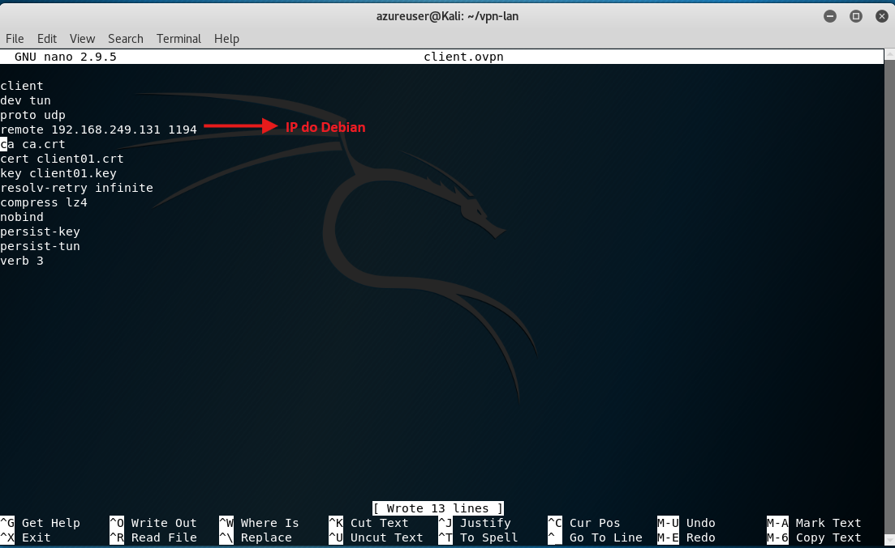

* **`remote 192.168.249.131 1194`**: Aponta para o IP do servidor Debian e a porta do OpenVPN.
* **`ca / cert / key`**: Indica os arquivos locais com os certificados e chave.
* **`nobind`**: Permite que o cliente use uma porta dinâmica para sair.

---

## 6. Testes Práticos e Validação da Conexão

### Conectando o Cliente à VPN

Executamos o OpenVPN com privilégios de administrador no Kali:

```bash
sudo openvpn --config client.ovpn
```

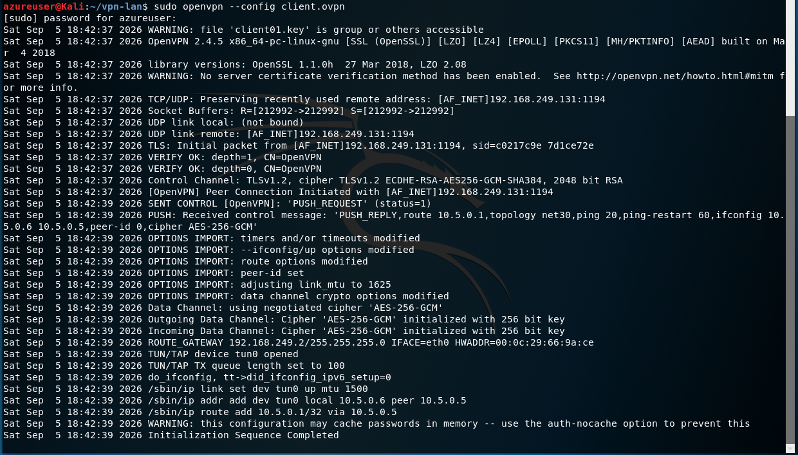

**O que os logs mostraram:**
1. **Validação mútua:** O cliente validou o certificado da CA (`VERIFY OK: CN=OpenVPN`).
2. **Criptografia:** O túnel negociou a cifra simétrica `AES-256-GCM` para proteger os dados.
3. **Rede Virtual:** Foi criada a placa virtual `tun0` e o Kali recebeu o IP `10.5.0.6`.
4. **Sucesso:** A mensagem `Initialization Sequence Completed` indicou que o túnel estava pronto para uso.

---

### Teste de Comunicação (Ping ICMP)

Para testar se o tráfego estava realmente passando pelo túnel até o servidor, enviamos pacotes de ping para o IP virtual do servidor (`10.5.0.1`):

```bash
ping 10.5.0.1
```

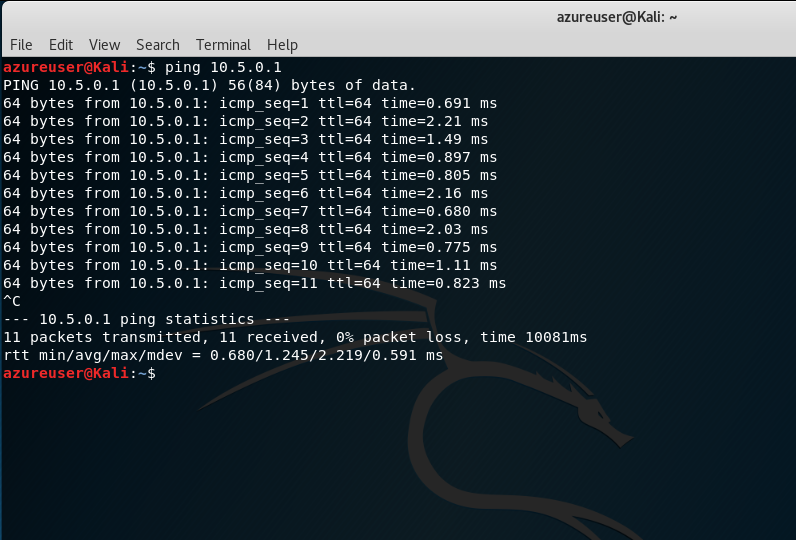

* **Resultado:** 11 pacotes enviados e 11 recebidos (**0% de perda**), com tempo de resposta muito rápido (~1ms), provando que o túnel estava funcionando perfeitamente.

---

## Aprendizados e Conclusões

Este laboratório permitiu compreender de forma prática os principais conceitos de VPN e criptografia:

* **Papel da Autoridade Certificadora (CA):** Entendi como a CA é o pilar da confiança. Se um cliente não tiver um certificado assinado pela CA da rede, ele é sumariamente rejeitado.
* **Diferença entre Chave Pública e Privada:** A chave privada nunca sai da máquina de origem, enquanto o certificado público é o que é compartilhado para autenticação.
* **Facilidade do Easy-RSA:** A ferramenta simplifica bastante comandos complexos do OpenSSL para gerar chaves, requisições e parâmetros Diffie-Hellman.
* **Túnel Seguro:** Foi gratificante ver a criação da interface `tun0` no cliente recebendo um IP da faixa `10.5.0.0/24` e conseguindo se comunicar diretamente com o servidor de forma isolada e criptografada.

---

**Laboratório realizado em:** Setembro de 2026

**Ambiente:** Debian 10 (Servidor) & Kali Linux (Cliente)

**Propósito:** Prática de Laboratório e Portfólio de Estudos em Cibersegurança

## Autor

**Fernando Oliveira Galvão Leite**
*Estudante de Segurança da Informação no SENAC São Paulo (Previsão de conclusão: 2027), buscando atuar na área de cibersegurança e proteção de infraestruturas.*
